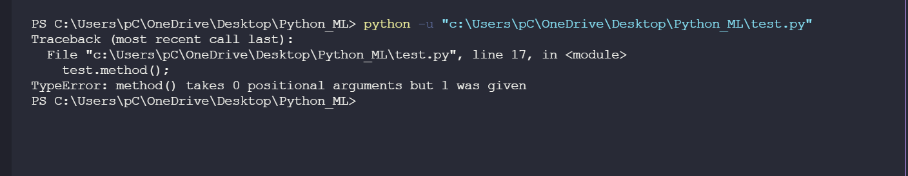
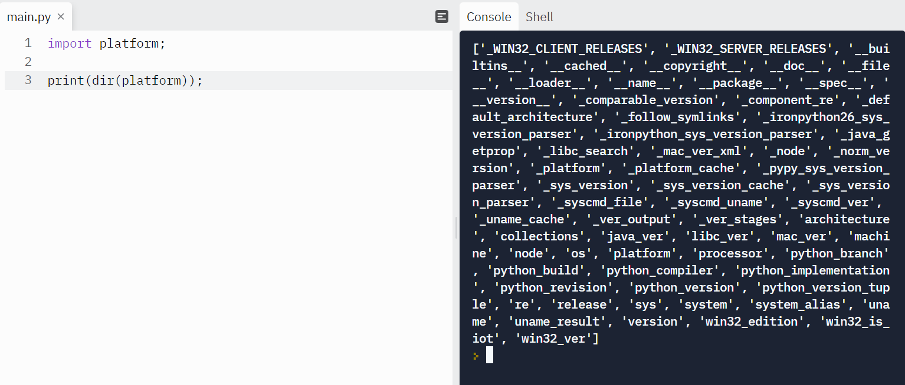
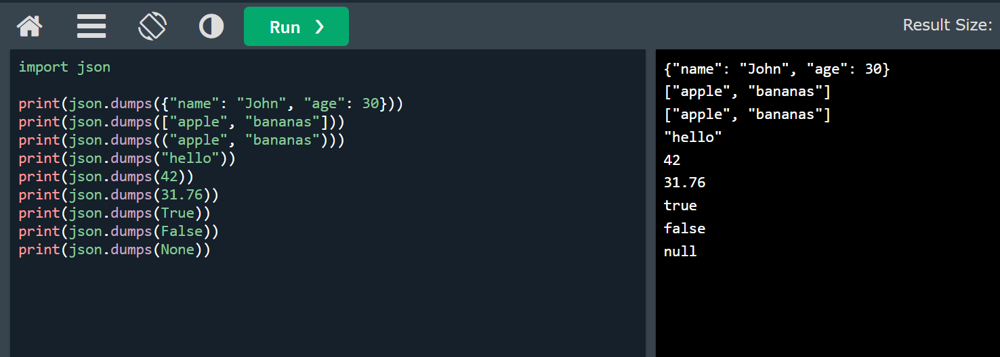
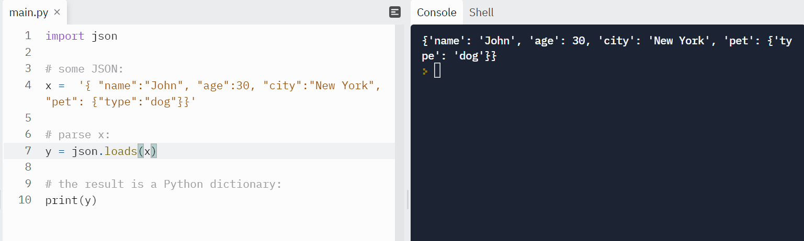
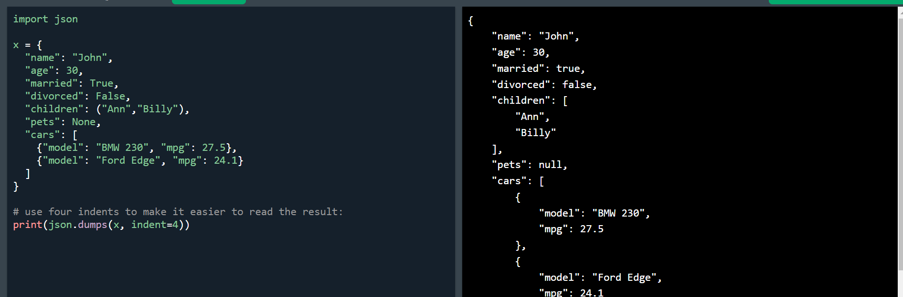
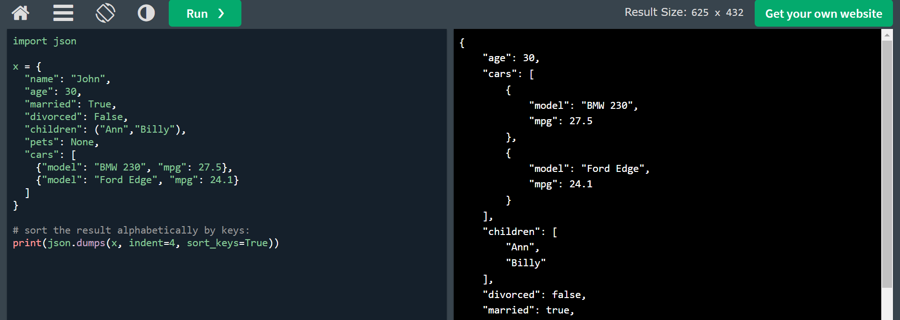

# Python and Machine Learning

# I. Class

## 1. Class basic

Syntax đơn giản của một class:

```Python
class tenClass:

    thuoctinh1 = "OK";

    def __init__(self, param1, param2):
        self.key1 = param1;
        self.key2 = param2;

    def method(banThanClass):
        print(banThanClass.key1);


# Khoi tao mot bien thuoc class:
test = tenClass(1,"hehe");
test.method()# in ra 1
print(test.thuoctinh1) # in ra "OK"
test.thuoctinh1 = 2;
print(test.thuoctinh1) #in ra 2
```

- Tham số đầu tiên của mọi method trong class `self`, `banThanClass` đều là cùng bản thân chính class đó, giống với `this` trong `Javascript`.

- Chú ý mọi method của class đều cần đưa vào một tham số, tham số đó là bản thân class. Nếu không đưa vào. Ví dụ:

```Python
    def method():
        print("ok");
```

Thì ta sẽ nhận lỗi sau khi chạy chương trình:



Lưu ý Python compile code synchronous, tức là theo thứ tự code lần lượt từ trên xuống => nếu trong class có 2 method trùng tên nhau thì method được khai báo sau sẽ override method được khai báo trước.

Ta có thể khai báo một class rỗng (không có gì bên trong như sau):

```Python
class Test:
    pass;
```

**Xóa thuộc tính hoặc class:**

```Python
del test.key1;
del test
```

- Chú ý chỉ xóa được thuộc tính gán bởi self trong `__init__` hoặc trong method, không xóa được thuộc tính khai báo độc lập trong class và không xóa được method.

- Không thể dùng `self` bên ngoài các method của class.

- Có thể gán `self.thuocTinh` bên trong mọi method, tuy nhiên nên khởi tạo các thuộc tính trong `__init__`.

## 2. Class Inheritance (kế thừa):

Tương tự như các ngôn ngữ hướng đối tượng khác. OOP của python cũng có tính kế thừa.

Class con kế thừa class cha sẽ có toàn bộ thuộc tính và method của class cha, ngoài ra thì class con có thể khai báo thêm các thuộc tính, method khác nữa...

Ta có ví dụ:

class cha:

```Python
class Parent:
    testVar = "ok";
    def __init__(self, ten, tuoi):
        self.ten = ten;
        self.tuoi = tuoi;

    def showDetail(self):
        print("Ten: {}\n Tuoi: {}".format(self.ten, self.tuoi))
```

class con kế thừa class cha:

```Python
class Children(Parent):
    def __init__(self,ten):
        self.ten = ten;
    
    def showDetail(self):
        print(self.ten);
```

Để kế thừa thì cú pháp đơn giản là `class con(cha):`.

Đối với cách khai báo như trên thì `__init__` của class `Children` sẽ ghi đè lên `__init__` của `Parent`, `showDetail` cũng vậy.

Để mang tính kế thừa, ta gọi `__init__` của `Person` trong `__init__` của `Children`:

```Python
class Children(Parent):
    def __init__(self,ten, tuoi, gioiTinh):
        Parent.__init__(self,ten,tuoi);
        self.gioiTinh = gioiTinh;
    
    def showDetail(self):
        Parent.showDetail(self);
        print("Gioi tinh: ", self.gioiTinh);
```

Thực hiện:

```Python
myChild = Children("son",20,"nam");
myChild.showDetail()
#ket qua:
# Ten: son
# Tuoi: 20
# Gioi tinh: nam
print(myChild.testVar)# ok
```

**Chú ý `self` param khi gọi method của class cha trong class con.**

Hoặc ta có thể dùng `super()` để kế thừa như sau:

```Python
class Children(Parent):
    def __init__(self,ten, tuoi, gioiTinh):
        super().__init__(ten,tuoi);
        self.gioiTinh = gioiTinh;
    
    def showDetail(self):
        super().showDetail();
        print("Gioi tinh: ",self.gioiTinh);
```

Sử dụng `super()` thì ta không cần thêm `self` vào hàm nữa.

Ta có thể khai báo thêm thuộc tính và method cho các `instance` của class sau khi đã tạo instance.

```Python
test = Children("son",20,"nam");
test.thuocTinhngoai = "test";
def myMethod():
    print("test");

test.methodNgoai = myMethod;
```

## 3. Iterators trong class

Có 2 method để tạo Iterators:

- `__iter__()`
- `__next__()`

Giống như `__init__`, cần phải được đặt đúng tên.

- Trong đó `__iter__` phải `return` iterator object

- `__next__` phải trả về item tiếp theo trong dãy

Ví dụ:

```Python
class MyNumbers:
  def __iter__(self):
    self.a = 1
    return self

  def __next__(self):
    x = self.a
    self.a += 1
    return x

myclass = MyNumbers()
myiter = iter(myclass)

print(next(myiter))
print(next(myiter))
print(next(myiter))
print(next(myiter))
print(next(myiter))
```

Với ví dụ trên, ta có thể cho lặp mãi với `next`

Ta có thể đặt điều kiện để dừng lặp như sau:

```Python
class MyNumbers:
  def __iter__(self):
    self.a = 1
    return self

  def __next__(self):
    if self.a <= 20:
      x = self.a
      self.a += 1
      return x
    else:
      raise StopIteration

myclass = MyNumbers()
myiter = iter(myclass)

for x in myiter:
  print(x)
```

# II. Modules

Tạo module bằng các file `.py` thông thường. Trong file có thể chỉ có một hàm xử lý logic, hoặc các biến hoặc nhiều hàm và biến.

Ví dụ trong file `mymodule.py`

```Python
def greeting(name):
  print("Hello, " + name)

person1 = {
  "name": "John",
  "age": 36,
  "country": "Norway"
}
```

Dùng trong project:

```Python
import mymodule

mymodule.greeting("SOn");
print(mymodule.person1["name"]);
```

Hoặc dùng alias:

```Python
import mymodule as md

md.greeting("son");
```

Chỉ import một phần từ module:

```Python
from mymodule import greeting

greeting("son");
```

Khi import from như trên thì không cần dùng `mymodule.greeting`


Ngoài ra còn các built-in module khác...

Ta có thể dùng `dir()` để kiểm tra xem trong module được import có những function và variables gì. Hàm này dùng được với tất cả module bao gồm built in module và module tự tạo.

Ví dụ:

```Python
import platform

x = dir(platform)
print(x)
```

Kết quả:



# III. JSON

Trong Python có built in module `json` cho phép chuyển python => json hoặc ngược lại

```Python
import json
```

method | chức năng
-------|----------
`json.loads()`| Chuyển từ code python sang JSON
`json.dumps()`| Chuyển từ JSON sang code python

Khi chuyển từ python sang json ta sẽ nhận được như sau:

Python | JSON
-------|-----
dict | Object
list | Array
tuple | Array
str | String
int | Number
float | Number
True | true
False | false
None | null





Khi chuyển từ python sang json, code hiển thị trên một dòng rất khó nhìn nên ta có thể format cho json code như sau:



Ta có thể sắp xếp key trong json bằng cách sau:



# IV Try...Except

  #|chức năng
-----|---------
`try`| test xem trong block code có errors không
`except`| nếu trong try có errors, errors được xử lý tại đây
`else`| execute code nào đó nếu như không có errors nào
`finally`| execute code cho dù có errors hay không


Ví dụ:

```Python
try:
  doSMT()
except:
  print("ERROR!");
```

Hoặc có thể có nhiều except:

```Python
try:
  print(x)
except NameError:
  print("Variable x is not defined")
except:
  print("Something else went wrong")
```

Trong đó `NameError` là lỗi được `raise` lên.

Chúng ta có thể tự `raise` lên error theo logic của chúng ta. Ví dụ như sau:

```Python
x = -1

if x < 0:
  raise Exception("Sorry, no numbers below zero")
```

Dùng `raise` kết hợp với các build in error function

```Python
x = "hello"

if not type(x) is int:
  raise TypeError("Only integers are allowed")
```

# V RegEX

# VI PIP

Lệnh | Chức năng
-----|----------
`pip install <package>`| Install package nào đó
`pip uninstall <package>`| gỡ package đã cài
`pip list` | Xem list các package đã cài

# VII File handling

Để làm việc với file, ta dùng `open()`.

**Syntax:**

```Python
open(filename, mode)
```

Trong đó mode là :

- `"r"` - Read: mặc định nếu ta không thêm tham số nào thì `open` có chức năng đọc file, hiện error nếu file không tồn tại
- `"a"` - Append: mở file để ghi thêm vào file, tự động tạo file nếu không tồn tại file cần mở.
- `"w"`- Writing: mở file để ghi file (ghi đè), tự tạo file nếu không tồn tại file cần mở
- `"x"`- Create: tạo file, trả về lỗi nếu file đã tồn tại.

Ngoài ra ta còn có thể chỉ định làm việc với file dạng binary hay text bằng cách đính kèm theo với các mode ở trên:

- `"t"` - Text: mặc định là làm việc với file text
- `"b"` - Binary: làm việc với file binary


**Ví dụ đọc file text**

```Python
f = open("demofile.txt", "rt")
```

tuy nhiên ta thấy ở đây `"r"` là đọc file, `"t"` là làm việc với file text. Đây là chế độ mặc định nên ta không cần đưa vào mà chỉ cần:

```Python
f = open("demofile.txt");
```

## 1. Đọc file

Giả sử có một file text như sau:

```text
Hello! Welcome to demofile.txt
This file is for testing purposes.
Good Luck!
```

Đối với những file ở trong cùng thư mục, việc đọc file như sau:

```Python
f = open("demofile.txt", "r")
print(f.read())
```

Chỉ cần dùng `filename` là truy cập được để mở file. Sau đó dùng `.read()` để đọc toàn bộ nội dung file.

Nếu như file không nàm cùng thư mục của chương trình đang chạy thì ta cần dùng `pathname` thay cho `filename`

```Python
f = open("D:\\myfiles\welcome.txt", "r")
print(f.read())
```

Có thể đọc giới hạn số lượng kí tự từ file:

```Python
f = open("demofile.txt", "r")
print(f.read(5))
```

Ví dụ trên ta không đọc toàn bộ file mà chỉ đọc 5 kí tự của file

Đọc từng dòng của file bằng `.readline()`

```Python
f = open("demofile.txt", "r")
print(f.readline())
print(f.readline())
```
Mỗi lần `readline` là đọc một dòng của file.

Ta có thể đọc lần lượt từng dòng của file như sau:

```Python
f = open("demofile.txt")
for line in f:
  print(line);
```

Sau khi hoàn thiện các phiên làm việc với file ta nên đóng file lại như sau:

```Python
f = open("demofile.txt", "r")
print(f.readline())
f.close()
```