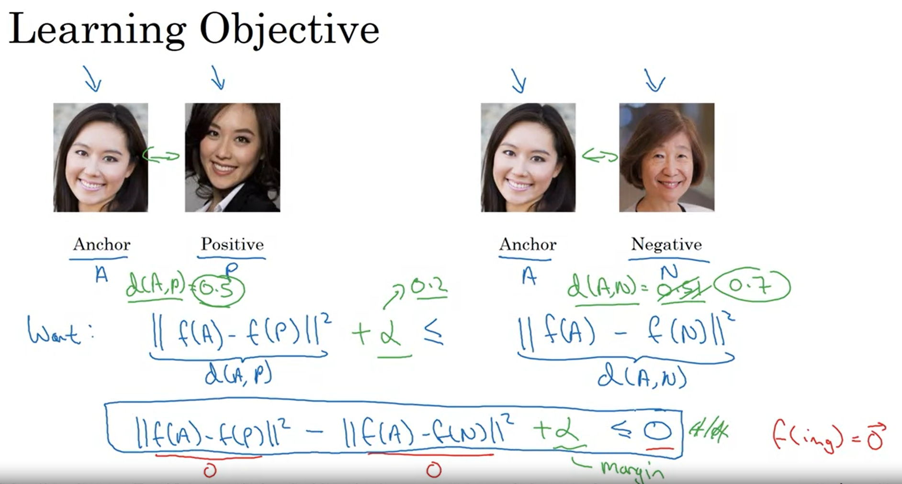
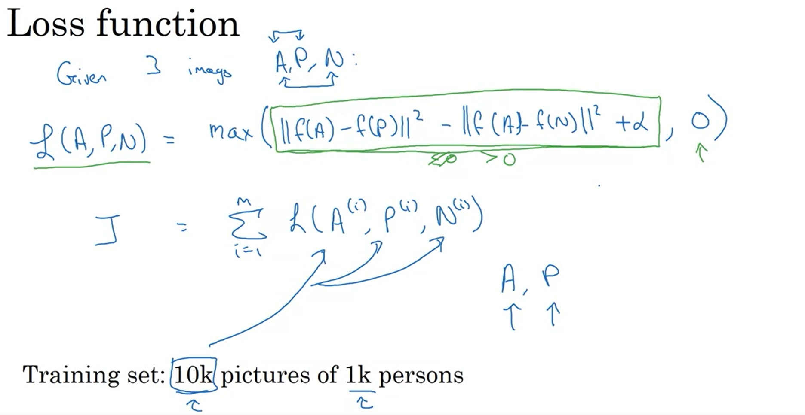
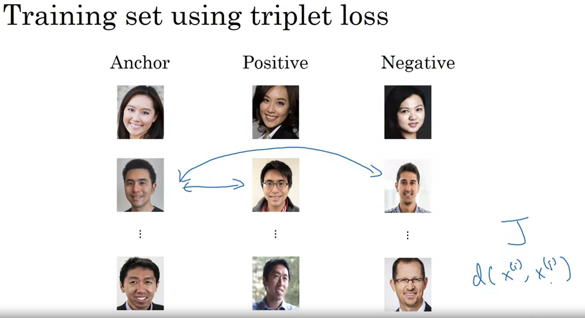
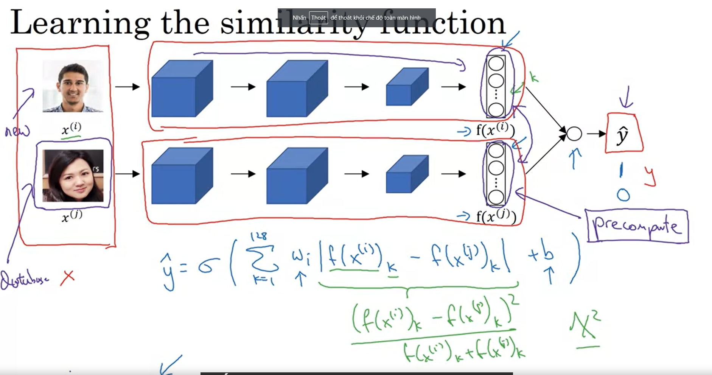
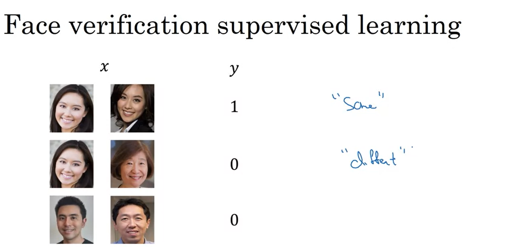

# Face recognition

## 1. One shot learning

Thay vì sử dụng mạng NN network để training trên tập dataset và đưa ra predict label thì ta sẽ sử dụng một hàm nào đó để so sánh 2 bức ảnh (một ảnh gốc và một ảnh mới cần nhận dạng).

Giả sử có ảnh gốc `img1` khi hệ thống nhận diện face recognition nhận vào ảnh `img2`

Khi đó ta so sánh:

```python
if d(img1, img2) < t:
    return True
else:
    return False
```

Như vậy `d(img1, img2)` càng nhỏ thì càng nói lên rằng nhận diện đúng.

## 2. Siamese Network

Ý tưởng là sử dụng cặp dữ liệu và apply chúng vào cùng một cấu trúc mạng Neural network với cùng càng thống số và parameters. Đầu ra của mạng NN cho mỗi cặp dữ liệu là 1 cặp vector dùng để tính toán sự khác nhau giữa chúng. 


## 3. Triplet loss



Note: mong muốn đặt ra là `between` giữa cặp ảnh `(thật, đúng)` (giá trị nhỏ) và cặp ảnh `(thật, giả)`( giá trị lớn) phải cách xa nhau 1 con số khá lớn.

=> Đặt thêm giá trị $\alpha$ là `margin`. Qua đó ta thấy ví dụ `d(A, p)` = 0.5 và `d(A, n)` = 0.5, tuy đã thỏa mãn điều kiện `d(A, p) <= d(A, n)` nhưng có vẻ như điều này là không đúng lắm vì ta mong muốn thực tế là 2 giá trị trên phải khác xa nhau khá nhiều cơ => ta cần thêm giá trị `margin` $\alpha$, khi đó thì VT = 0.5 + $\alpha$ = 0.7 => Ta cần `d(A,p)` phải >= 0.7 thì mới thỏa mãn.

### a) Triplet loss function



### b) Choosing the triplets A, P, N

Trong quá trình training, nếu A, P, N được chọn một cách ngẫu nhiên thì BĐT `d(A, P) + alpha <= d(A, N)` dễ dàng thỏa mãn

### c) Training using triplet loss



## 4. Face verification and Binary Classification



