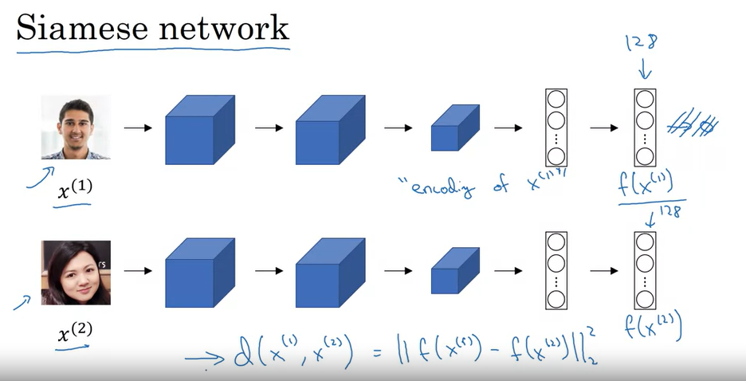

# Face recognition

## 1. One shot learning

Thay vì sử dụng mạng NN network để training trên tập dataset và đưa ra predict label thì ta sẽ sử dụng một hàm nào đó để so sánh 2 bức ảnh (một ảnh gốc và một ảnh mới cần nhận dạng).

Giả sử có ảnh gốc `img1` khi hệ thống nhận diện face recognition nhận vào ảnh `img2`

Khi đó ta so sánh:

```python
if d(img1, img2) < t:
    return True
else:
    return False
```

Như vậy `d(img1, img2)` càng nhỏ thì càng nói lên rằng nhận diện đúng.

## 2. Siamese Network

Ý tưởng là sử dụng cặp dữ liệu và apply chúng vào cùng một cấu trúc mạng Neural network với cùng càng thống số và parameters. Đầu ra của mạng NN cho mỗi cặp dữ liệu là 1 cặp vector dùng để tính toán sự khác nhau giữa chúng. 



## 3. Triplet loss