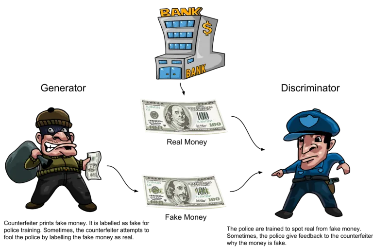
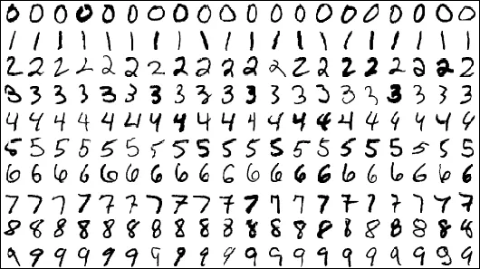
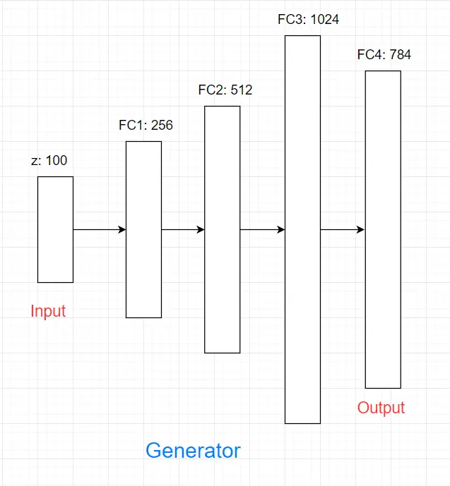
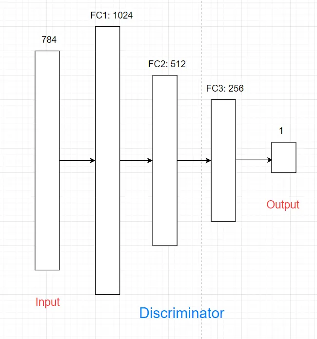
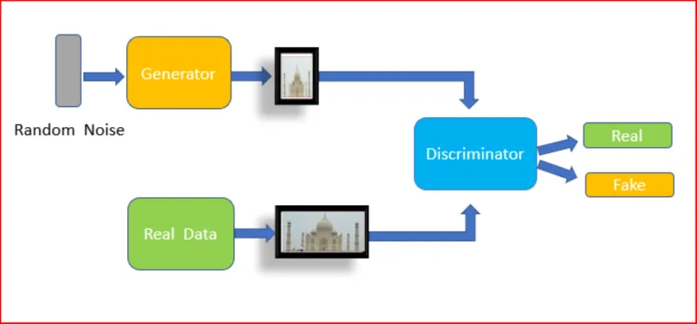
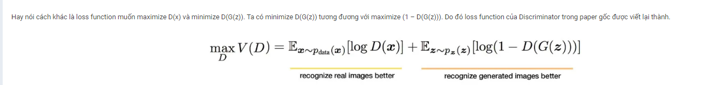
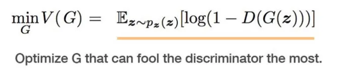
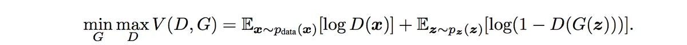

# GAN

## I. Giới thiệu

Cấu trúc mạng GAN gồm 2 mạng là `Generator` và `Discriminator`. Trong khi `Generator` sinh ra các dữ liệu giống như thật thì `Discriminator` cố gắng phân biệt đâu là dữ liệu được sinh ra từ `Generator` và đâu là dữ liệu thật có.



Minh họa các mạng trong GAN. Nguồn: [https://dzone.com/articles/working-principles-of-generative-adversarial-netwo](https://dzone.com/articles/working-principles-of-generative-adversarial-netwo)

**Ví dụ với bài toán dùng mạng GAN sinh ra các chữ số viết tay giống dữ liệu trong MNIST dataset.**

### 1. Generator

Generator là mạng sinh ra dữ liệu, tức là sinh ra các chữ số giống với dữ liệu trong MNIST dataset. Generator có input là noise (random vector) và output là chữ số. `Noise` cho generator thường được sinh ra từ normal distribution hoặc uniform distribution



Sau đây là mô hình Neural network được áp dụng với số nốt trong hidden layer lần lượt là 256, 512, 1024



Ouput là vector số chiều 784 vì output đầu ra là ảnh giống với dữ liệu MNIST ( ảnh xám 28x28).

Do vậy output `784*1` sẽ được reshape về `28*28` cho đúng định dạng dữ liệu MNIST

```python
# Mô hình Generator
g = Sequential()
g.add(Dense(256, input_dim=z_dim, activation=LeakyReLU(alpha=0.2)))
g.add(Dense(512, activation=LeakyReLU(alpha=0.2)))
g.add(Dense(1024, activation=LeakyReLU(alpha=0.2)))
# Vì dữ liệu ảnh MNIST đã chuẩn hóa về [0, 1] nên hàm G khi sinh ảnh ra cũng cần sinh ra ảnh có pixel value trong khoảng [0, 1] => hàm sigmoid được chọn
g.add(Dense(784, activation='sigmoid'))  
g.compile(loss='binary_crossentropy', optimizer=adam, metrics=['accuracy'])
```

### 2. Discriminator

Discriminator là mạng để phân biệt xem dữ liệu là thật (dữ liệu từ dataset) hay giả (dữ liệu sinh ra từ Generator). Trong bài toán này thì discriminator dùng để phân biệt chữ số từ bộ MNIST và dữ liệu sinh ra từ Generator. Discriminator có input là ảnh biểu diễn bằng 784 chiều, output là ảnh thật hay ảnh giả.




```Python
# Mô hình Discriminator
d = Sequential()
d.add(Dense(1024, input_dim=784, activation=LeakyReLU(alpha=0.2)))
d.add(Dropout(0.3))
d.add(Dense(512, activation=LeakyReLU(alpha=0.2)))
d.add(Dropout(0.3))
d.add(Dense(256, activation=LeakyReLU(alpha=0.2)))
d.add(Dropout(0.3))
# Hàm sigmoid cho bài toán binary classification
```

### 3. Loss function

Kí hiệu:

- `z`: noise đầu vào của generator
- `x`: dữ liệu thật từ bộ dataset
- `G`: mạng Generator
- `D`: mạng Discriminator

=> `D(x)` là giá trị dự đoán của Discriminator xem ảnh x là thật hay giả.
=> `D(G(z))` là giá trị dự đoán của Discriminator xem ảnh sinh ra bởi generator là ảnh thật hay giả.

Do đầu ra đi qua hàm sigmoid => thuộc `[0,1]` nên ta mong muốn `D(x)` gần 1 (ảnh thật), `D(G(z))` gần 0 (ảnh giả)





E là kì vọng, hiểu đơn giản là lấy trung bình của tất cả dữ liệu, hay maximize D(x) với x là dữ liệu trong traning set.

Generator sẽ học để đánh lừa Discriminator rằng số nó sinh ra là số thật, hay D(G(z)) -> 1. Hay loss function muốn maximize D(G(z)), tương đương với minimize (1 – D(G(z)))



Do đó ta có thể viết gộp lại loss của mô hình GAN:



Từ hàm loss của GAN có thể thấy là việc train Generator và Discriminator đối nghịch nhau, trong khi D cố gắng maximize loss thì G cố gắng minimize loss. Quá trình train GAN kết thúc khi model GAN đạt đến trạng thái cân bằng của 2 models, gọi là Nash equilibrium.

[Ví dụ GAN với keras](./gan.ipynb)

## II. Deep Convolutional Generative Adversarial Network (DCGAN)

## III. Conditional GAN (cGAN)

## IV. Least Squares Generative Adverarial Network (LSGAN)

## V. GAN evaluation

## VI. Image to image translation

## VII. Pix2pix

## VIII. CycleGAN

## IX. StarGAN
