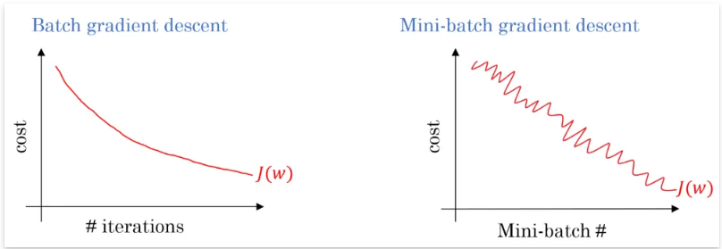
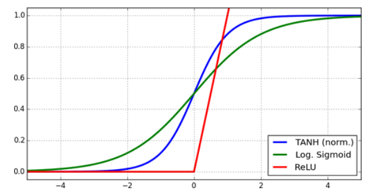
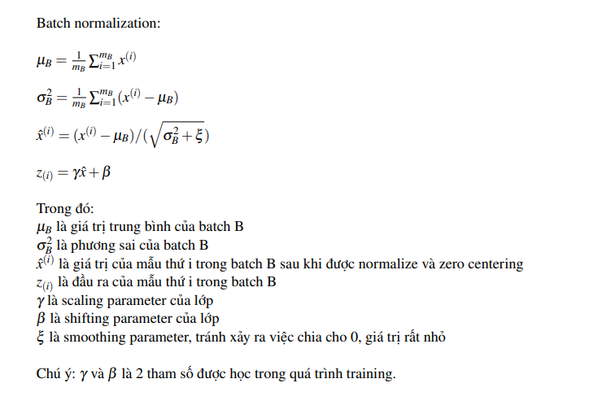

# Deep learning note

## I. CNN - Convolution Neural Network

Đọc chi tiết [tại đây](./cnn.md)

Các nội dụng chú ý trong CNN:

## Các kỹ thuật cơ bản trong deep learning

### 1. Vectorization

Sử dụng tính toán trên ma trận và vector ( như trong toán học)

### 2. Mini-batch gradient descent

Người ta thường chia gradient descent ra làm 3 loại :

- `Batch Gradient Descent`: Đây là loại mà ta vẫn hay dùng và hay nhắc đến, đó là dùng tất cả dữ liệu trọng training set cho mỗi lần thực hiện tính toán đạo hàm của loss với phương pháp này thì đánh giá cần dùng số epochs lớn => tính 1 lần loss_grad / 1 epoch

Mô tả với code:

```Python
epoch = 100
for epoch in range(epochs):
    loss_grad = grad(all_data)
    w = w - lr*loss_grad
```

- `Mini-batch gradient descent`: Thay vì dùng tất cả dữ liệu để tính thì ta sẽ chia nhỏ tập dữ liệu ra thành các tập dữ liệu con và thực hiện tính toán đạo hàm loss trên toàn bộ tập dữ liệu con này => N/batch_size lần loss_grad / 1 epoch

Mô tả với code:

```Python
epoch = 30
for epoch in range(epochs):
    for batch in all_data:
        loss_grad = grad(batch)
        w = w - lr*loss_grad
```

- `Stochastic gradient descent`: Ta sẽ sử dụng chỉ 1 điểm dữ liệu để tính đạo hàm loss => tính N lần loss_grad / 1 epoch. Số lần tính toán grad có thể nhiều nhưng t chỉ cần tính toán trên số epochs < epochs(tính cho batch GD)

Mô tả bằng code:

```Python
epochs = 10
for epoch in range(epochs):
    for one_data in all_data:
        loss_grad = grad(one_data)
        w = w - lr*loss_grad
```



Hình dưới là biểu diễn biệc cập nhật hệ số trong gradient descent, điểm đỏ là giá trị nhỏ nhất ta cần tìm, các điểm ở ngoài cùng là giá trị khởi tạo của hệ số trong gradient descent. Ta có thể thấy vì không có nhiễu nên batch gradient descent thì hệ số cập nhật trực tiếp theo 1 đường thẳng. Mini-batch thì mất nhiều thời gian hơn và còn đi chệch hướng tuy nhiên thì vẫn đến được điểm đỏ. Còn stochastic thì đi khá lòng vòng để đến được điểm đỏ và vì dữ liệu quá nhiễu nên có thể thuật toán gradient descent chỉ quanh điểm đỏ mà không đến được điểm đỏ (minimum point).


**Lời khuyên:**

- `Batch size` nên được chọn là số mũ của 2 ví dụ 16, 32, 64 để CPU/GPU tính toán tốt hơn. Giá trị mặc định là 32
- Nên vẽ đồ thị loss/epoch để chọn `batch size` phù hợp

### 3. Bias và variance 

- `Bias`: độ lệch , biểu thị sự chênh lệch giữa giá trị trung bình mà mô hình dữ đoán và giá trị thực tế của dữ liueej

- `variance`: phương sai biểu thị độ phân tán của các giá trị mà mô hình dữ đoán so với giá trị thực tế


Điều ta mong muốn là low bias và low variance như vậy mô hình sẽ đạt kết quả là tốt nhất.

| Train set error |       1%      |    15%    |           15%           |          0.5%         |
|:---------------:|:-------------:|:---------:|:-----------------------:|:---------------------:|
|  Val set error  |      11%      |    16%    |           30%           |           1%          |
|                 | High variance | High bias | High bias High variance | Low bias Low variance |


#### Giải quyết high bias (underfitting): Ta cần tăng độ phức tạp của model

- Tăng số lượng hidden layer và số node trong mỗi hidden layer.
- Dùng nhiều epochs hơn để train model.

#### Giải quyết high variance (overfitting):

- Thu thập thêm dữ liệu hoặc dùng data augmentation
- Dùng regularization như: L1, L2, droupout

### 4. Dropout

Dropout với hệ số p nghĩa là trong quá trình train model, với mỗi lần thực hiện cập nhật hệ số trong gradient descent ta ngẫu nhiên loại bỏ p% số lượng node trong layer đấy, hay nói cách khác là dữ lại (1-p%) node. Mỗi layer có thể có các hệ số dropout p khác nhau.


**Dropout hạn chế việc overfitting:**

Overfitting là mô hình đang dùng quá phức tạp so với mô hình thật của dữ liệu. Khi ta dùng dropout như hình trên thì rõ ràng mô hình bên phải đơn giản hơn => tránh overfitting.

Thêm vào đó, vì mỗi bước khi train model thì ngẫu nhiên (1-p%) các node bị loại bỏ nên model không thể phụ thuộc vào bất kì node nào của layer trước mà thay vào đó có xu hướng trải đều weight, giống như trong L2 regularization => tránh được overfitting.

**Note:**

- Hệ số p nên ở khoảng [0.2, 0.5] . Nếu p quá nhỏ thì không có tác dụng chống overfitting, tuy nhiên nếu p quá lớn thì gần như loại bỏ layer đấy và có dễ dẫn đến underfitting.
- Nên dùng model lớn, phức tạp hơn vì ta có dropout chống overfitting.
- Dropout chỉ nên dùng cho fully connected layer, ít khi được dùng cho ConvNet layer
- Hệ số p ở các layer nên tỉ lệ với số lượng node trong FC layer đó.

### 5. Batch Normalization

Một trong những giả định chính được đưa ra trong quá trình huấn luyện một mô hình học máy đó là phần phối của dữ liệu được giữ nguyên trong suốt quá trình training. Đối với các mô hình tuyến tính, đơn giản là ánh xạ input với output thích hợp, điều kiện này luôn được thỏa mãn. Tuy nhiên trong trường hợp Neural Network với các lớp được xếp chồng lên nhau, ảnh huonwgr của các hàm activation non-linear, điều kiện trên không còn đúng nữa.

Trong kiến trúc neural network, đầu vào của mỗi lớp phụ thuộc nhiều vào tham số của toàn bộ các lớp trước đó. Hậu quả là trong quá trình back propagation, các trọng số của một lớp được cập nhạt dẫn đến những thay đổi về mặt dữ liệu sau khi đi qua lớp đó. Những thay đổi này bị khuếch đại khi mạng trở nên sâu hơn và cuối cùng làm phân phối của bản đồ đặc trưng (feature map) thay đổi, đây được gọi là hiện tượng covariance shifting. Khi huấn luyện, các lớp luôn phải điều chỉnh trọng số để đáp ứng những thay đổi về phân phối dữ liệu nhận được từ các lớp trước, điều này làm chậm quá trình hội tụ của mô hình.

#### Vấn đề 1:

- Khi dữ liệu chứa nhiều thành phần lớn hơn hoặc nhỏ hơn 0 và không phân bố quanh giá trị trung bình 0 (non zero mean), kết hợp với việc phương sai lớn (high variance) làm cho dữ liệu chứa nhiều thành phần rất lớn hoặc rất nhỏ. Trong quá trình cập nhật trọng số bằng gradient descent, giá trị của dữ liệu ảnh hưởng trực tiếp lên giá trị đạo hàm (gradient), dó đó làm cho giá trị gradient trở lên quá lớn hoặc quá nhỏ => điều này không tốt. Hiện tượng trên xuất hiện kahs phổ biến, phụ thuộc nhiều vào việc khởi tạo trọng số, và có xu hướng nghiêm trọng hơn khi mạng ngày càng sâu.

=> Cần một bước normalize các thành phần dữ liệu về cùng mean và chuẩn hóa variance.

#### Vấn đề 2:

- Các hàm activation non-linear như sigmoid, relu, tanh,... đều có ngưỡng hay vùng bão hòa. Khi lan truyền thẳng, nếu dữ liệu có các thành phần quá lớn hoặc quá nhỏ, sau khi đi qua các hàm activation, các thành phần này sẽ rơi vào vùng bão hòa và có đầu ra giống nhau. Điều này dẫn đến luồng dữ liệu sau đó trở nên giống nhau khi lan truyền trong mạng (covariance shifting), lúc này các lớp còn lại trong mạng không còn phân biệt được các đặc trưng khác nhau. Ngoài ra, đạo hàm tại ngưỡng của các hàm activation bằng 0, điều này cùng khiến mô hình bị vanishing gradient.

=> Cần một bước normalize dữ liệu trước khi đi qua hàm activation



#### Khái niệm batch normalization

`Batch normalization` thực hiện việc chuẩn hóa (normalizing) và zero centering (mean subtracting) dữ liệu trước khi đưa qua hàm activation (giá trị trung bình (mean) sẽ  được đưa về 0 và phương sai (variance) sẽ được đưa về 1). Để thực hiện 2 công việc trên, batch normaliztion tính toán phương sai và độ lệch chuẩn của dữ liệu dựa trên các batchs, rồi sử dụng 2 tham số $\gamma$ và $\beta$ tinh chỉnh đầu ra.



#### Hiệu quả của batch normalization

* Batch normalization đưa dữ liệu về zero mean và chuẩn hóa variance trước khi đưa qua
activation function nhờ đó giải quyết các vấn đề vanishing gradient hay exploding gradient.

* Batch normalization cho phép learning rate lớn trong quá trình huấn luyện.

* Batch-Norm giảm thiểu sự ảnh hưởng của quá trình khởi tạo trọng số ban đầu.

* Batch-Norm chuẩn hóa dữ liệu đầu ra của các layer giúp model trong quá trình huấn luyện
không bị phụ thuộc vào một thành phần trọng số nhất định. Do đó, Batch-norm còn được sử
dụng như một regularizer giúp giảm overfitting