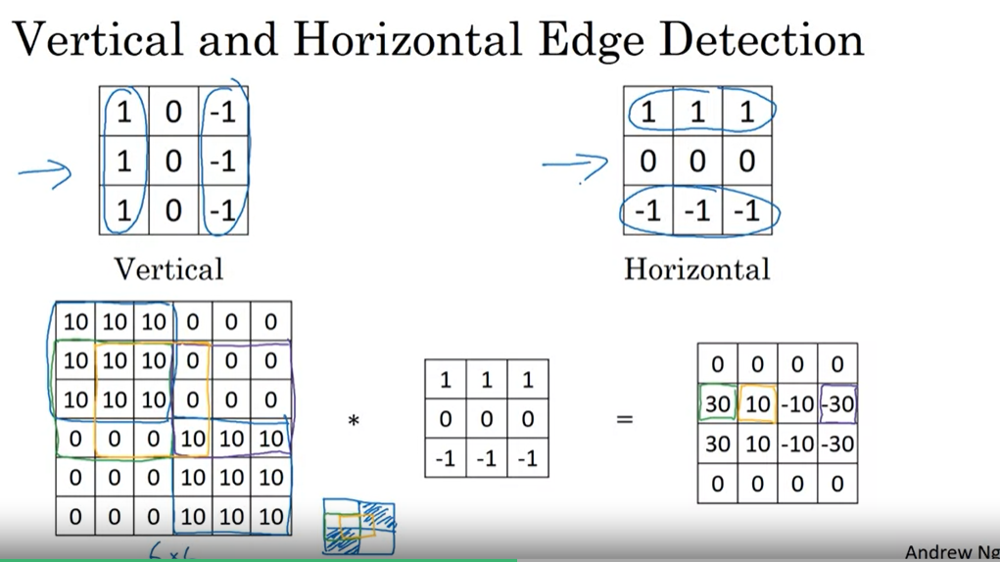
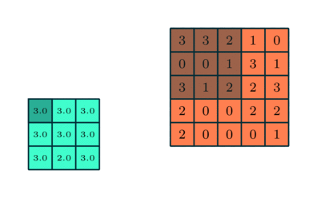

# Convolution Neural Network

## Table of contents
- [Convolution Neural Network](#convolution-neural-network)
  - [I. Edge Detection](#i-edge-detection)
    - [1. Overview](#1-overview)
    - [2. Filter Kernel](#2-filter-kernel)
    - [3. Convolution với ma trận ảnh có chiều sâu lớn hơn 1](#3-convolution-voi-ma-tran-anh-co-chieu-sau-lon-hon-1)
    - [4. Valid convolution và Same convolutions](#4-valid-convolution-va-same-convolutions)
  - [II. Convolution layer](#ii-convolution-layer)
  - [III. Pooling layer](#iii-pooling-layer)
  - [IV. LeNet-5](#iv-lenet-5)
  - [Tại sao phải sử dụng CNN](#tai-sao-phai-su-dung-cnn)

## I. Edge Detection

### 1. Overview

Trong ví dụ Edge Detection cho một ảnh xám đơn giản, ta sử dụng 1 ma trận kernel (hay filter) có số chiều lẻ 1x1, 3x3, 5x5, ...để thực hiện phép chập với ma trận ảnh với mục đích xác định ra điểm biên của ảnh.

Đi sâu hơn vào việc sử dụng ma trận kernel xác định biên ảnh ta có vị dụ sau.

Giả sử có một mảnh ảnh có ma trận điểm ảnh như sau:

Ta thấy rằng tại biên giao giữa các giá trị điểm ảnh 10 và 0 chính là biên ảnh mà ta muốn detect, hay có thể nói là biên ảnh là vị trí mà có sự chênh lệch giá trị của các điểm ảnh nhiều nhất.

Với ma trận kernel 3x3 sau:

Ta thấy ma trận này có các giá trị 1 và -1 đối xứng nhau => sẽ làm triệt tiêu đi các giá trị điểm ảnh gần nhau hay sẽ thành màu đen (giá trị điểm ảnh là 0). Vì vậy mà tại vị trí có các điểm ảnh chênh lệch nhau lớn sẽ cho ra đường biên màu trắng.

### 2. Filter Kernel

#### a. Vị trí của các giá trị 1 và -1 trong ma trận kernel ảnh hưởng thế nào đến việc detect edge

Với ví dụ ở phần overview, ta thấy với ma trạn điểm ảnh có đặc trưng bên trái lighter so với bên phải (giá trị điểm ảnh cao hơn), ta dùng ma trận kernel có đặc trưng tương tự với giá trị 1 năm bên trái và -1 nằm bên phải. Qua đó có vẻ cho ta được khá chính xác biên ảnh cần xác định.

Vậy đối với ma trận điểm ảnh có đặc trưng ngược lại, bên phải sáng hơn thì sao.

Ta thấy rằng kết quả của việc sử dụng ma trận kernel không đổi trên đã cho ra giá trị biên ảnh âm so với ban đầu, đồng nghĩa với việc màu tối hơn => Kết quả không như mong muốn.

Từ 2 ví dụ trên ta có thể suy ra được ma trận `Horizontal Edge` như sau:

#### b. Các loại ma trận kernel khác nhau thì sẽ giúp exact ra các feature của ảnh khác nhau

Ta thấy rằng, việc sử dụng các ma trận kernel khác nhau thì xác định ra các feature của ảnh khác nhau. Vì vậy ta có thể ứng dụng vào trong Neural network bằng cách coi ma trận kernel chính là các weight mà ta cần đi tối ưu.

Vậy sau quá trình training ta sẽ xác định được ra một cách chính xác hơn ma trận kernel cần để có thể sử dụng cho quá trình prediction.

#### c. Padding

Ta thấy có một vấn đề khi thực hiện phép chập đó chính là ảnh kết quả của phép chập sẽ nhỏ hơn so với ảnh ban đầu. Ví dụ với kích thước ma trận kernel là 3x3 => Ảnh kết quả sẽ có số chiều giảm đi là 2 so với ma trận ảnh ban đầu (Mất biên)

Để tránh việc ảnh bị co như trên, ta có thể sử dụng một phương pháp là padding ảnh tức là thêm các giá trị 0 vào vùng quanh ảnh để ảnh bị co lại bằng đúng kích thước ban đầu.

Ví dụ với ma trận kernel là 3x3 thì ta sẽ thêm 1 lớp padding 0:

#### d. Stride

Với các ví dụ bên trên, kernel ta sử dụng trong phép chập mỗi bước tiến 1 điểm ảnh (theo cả 2 phương ngang và thẳng đứng) hay `stride = 1`.

Với khái niệm `stride = 2` thì kernel sẽ di chuyển 2 điểm ảnh (theo cả 2 phương ngang và thẳng đứng)sau mỗi bước trong phép chập. Ví dụ:

Step 1:

Step 2:

...

Step 4:

Sau tất cả các bước:

**Cross - correlation**

Với ma trận kernel ban đầu:

Sau khi flip:

Vậy ta có:

### 3. Convolution với ma trận ảnh có chiều sâu lớn hơn 1 

Ví dụ ta muốn thực hiện Convolution cho RGB images ( ảnh có chiều sâu là 3):

**Công thức để tính toán số chiều của ảnh khi sử dụng padding và ma trận kernel:**

Giả sử:

- Ảnh có số chiều là `HxWxD`
- Ma trận kernel có số chiều là `FxFxD`

(Ma trận kernel và ảnh có chiều sâu là như nhau)

- Với padding thêm là `P`

- Stride là `S`

### 4. Valid convolution và Same convolutions

- `Valid convolution` là khi sử dụng phép chập ta `không sử dụng padding` cho ma trận ảnh => ảnh bị shrink

- `Same convolution` là khi sử dụng phép chập ta `padding cho ảnh` sao cho phù hợp với size của filter kernel để ảnh đầu ra của phép chập có số chiều bằng với số chiều của ảnh gốc

## II. Convolution layer

Với 1 convolution layer ta thường có các tham số sau:

Ví dụ:

## III. Pooling layer

Có 2 loại pooling layer thường được sử dụng là

- Max pooling layer: Lấy max của các phần tử được áp filter lên trong ma trận input
- Average pooling layer: Lấy trung bình cộng của các phần tử được áp filter lên trong ma trận input

Các tham số (hyper parameters) sử dụng trong pooling layer là :

- Loại pooling layer (max or average)
- filter size: thường được sử dụng là 2x2
- stride: thường được sử dụng là 2

Ví dụ với max pooling layer có size = (3,3), stride = 1, padding = 0

Thông thường loại pooling layer hay được sử dụng là Max pooling layer (stride =2, size = 2x2) thì số chiều (không tính số channel hay chiều sâu) của input bị giảm đi 2.

[_Nguồn: http://cs231n.github.io/convolutional-networks/_](http://cs231n.github.io/convolutional-networks/)

**2 Loại pooling layer:**

## IV. Classic CNN

### 1. [LeNet-5](./lenet-5.ipynb)

### 2. [AlexNet](./alexnet.ipynb)

### 3. [VGG-16](./vgg_16.ipynb)

### 4. [ResNet](./resnet.ipynb)

## V. Inception network

[Chi tiết](./inception.ipynb)

## VI. R-CNN ( Regional convolution neural network) cho bài toán object detection

Thông thương ta chỉ sử dụng CNN cho trong việc nhận diện chữ viết tay hoặc ảnh chỉ có một đối tượng

Khi mở rộng ra với việc bức ảnh có nhiều đối tượng thì bài toán trở nên phức tạp hơn đó là ta cần xác định được vị trí của các đối tượng hay cần xác định các bounding box (hình chữ nhật) bao quanh đối tượng. Với mỗi bounding box thì cần phần loại xem đấy là đối tượng gì (chó, ngựa, ô tô...) với bao nhiêu phần trăm chắc chắn.

**R-CNN (Region with CNN feature):**

Ý tưởng của thuật toán R-CNN là:

- Bước 1: Dùng Selective Search algorithm để lấy ra khoảng 2000 bounding box trong input mà có khả năng chứa đối tượng

- Bước 2: Với mỗi bounding box ta xác định xem nó là đối tượng nào (người, ô tô, xe đạp, ...)

### Select search algorithm

Input của thuật toán là ảnh màu, output là khoảng 2000 region proposal (bounding box) mà có khả năng chứa các đối tượng.

Đầu tiên ảnh được segment qua thuật toán [Graph Based Image Segmentation](http://cs.brown.edu/people/pfelzens/segment/), thuật toán dựa vào lý thuyết đồ thị và không áp dụng deep learning

## Tại sao phải sử dụng CNN

Có 2 lợi ích chính (Theo thầy Andrew Ng):

- parameters sharing
- sparsity of connections

Chi tiết:

Giả sử có 32x32x3 input, sử dụng 6 filter (5x5), sau convolution layer nhận được outputs 28x28x6

Giả sử như không sử dụng convolution layer mà ta lại sử dụng Neural Network với fully connected node thì ta có:

- Input : 3,072 node
- Output: 4,704 node

Như vậy cần sử dụng tất cả 3,072x4,7403 ~= 14M connection, đây là một con số rất lớn

Nhưng nếu sử dụng convolution layer thì ta chỉ cần 6x(5x5x3+1) = 456  parameters (1 là bias)

Ví dụ cho mô hình CNN nhận dạng số :

