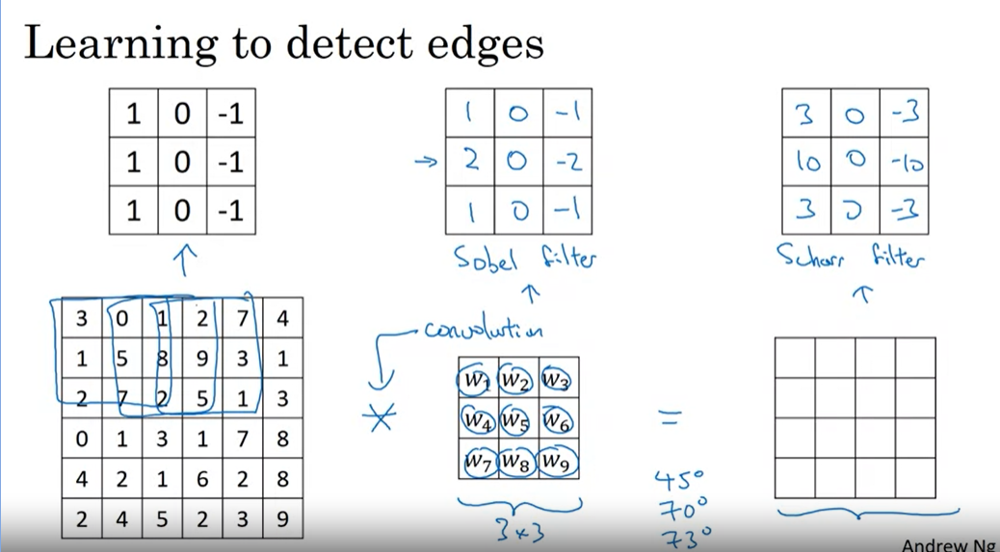

# Convolution Neural Network

## Table of contents
- [Convolution Neural Network](#convolution-neural-network)
  - [I. Edge Detection](#i-edge-detection)
    - [1. Overview](#1-overview)
    - [2. Filter Kernel](#2-filter-kernel)
    - [3. Convolution với ma trận ảnh có chiều sâu lớn hơn 1](#3-convolution-voi-ma-tran-anh-co-chieu-sau-lon-hon-1)
    - [4. Valid convolution và Same convolutions](#4-valid-convolution-va-same-convolutions)
  - [II. Convolution layer](#ii-convolution-layer)
  - [III. Pooling layer](#iii-pooling-layer)
  - [IV. LeNet-5](#iv-lenet-5)
  - [Tại sao phải sử dụng CNN](#tai-sao-phai-su-dung-cnn)

## I. Edge Detection

### 1. Overview

Trong ví dụ Edge Detection cho một ảnh xám đơn giản, ta sử dụng 1 ma trận kernel (hay filter) có số chiều lẻ 1x1, 3x3, 5x5, ...để thực hiện phép chập với ma trận ảnh với mục đích xác định ra điểm biên của ảnh.

Đi sâu hơn vào việc sử dụng ma trận kernel xác định biên ảnh ta có vị dụ sau.

Giả sử có một mảnh ảnh có ma trận điểm ảnh như sau:

Ta thấy rằng tại biên giao giữa các giá trị điểm ảnh 10 và 0 chính là biên ảnh mà ta muốn detect, hay có thể nói là biên ảnh là vị trí mà có sự chênh lệch giá trị của các điểm ảnh nhiều nhất.

Với ma trận kernel 3x3 sau:

Ta thấy ma trận này có các giá trị 1 và -1 đối xứng nhau => sẽ làm triệt tiêu đi các giá trị điểm ảnh gần nhau hay sẽ thành màu đen (giá trị điểm ảnh là 0). Vì vậy mà tại vị trí có các điểm ảnh chênh lệch nhau lớn sẽ cho ra đường biên màu trắng.

### 2. Filter Kernel

#### a. Vị trí của các giá trị 1 và -1 trong ma trận kernel ảnh hưởng thế nào đến việc detect edge

Với ví dụ ở phần overview, ta thấy với ma trạn điểm ảnh có đặc trưng bên trái lighter so với bên phải (giá trị điểm ảnh cao hơn), ta dùng ma trận kernel có đặc trưng tương tự với giá trị 1 năm bên trái và -1 nằm bên phải. Qua đó có vẻ cho ta được khá chính xác biên ảnh cần xác định.

Vậy đối với ma trận điểm ảnh có đặc trưng ngược lại, bên phải sáng hơn thì sao.

Ta thấy rằng kết quả của việc sử dụng ma trận kernel không đổi trên đã cho ra giá trị biên ảnh âm so với ban đầu, đồng nghĩa với việc màu tối hơn => Kết quả không như mong muốn.

Từ 2 ví dụ trên ta có thể suy ra được ma trận `Horizontal Edge` như sau:

#### b. Các loại ma trận kernel khác nhau thì sẽ giúp exact ra các feature của ảnh khác nhau

Ta thấy rằng, việc sử dụng các ma trận kernel khác nhau thì xác định ra các feature của ảnh khác nhau. Vì vậy ta có thể ứng dụng vào trong Neural network bằng cách coi ma trận kernel chính là các weight mà ta cần đi tối ưu.

Vậy sau quá trình training ta sẽ xác định được ra một cách chính xác hơn ma trận kernel cần để có thể sử dụng cho quá trình prediction.

#### c. Padding

Ta thấy có một vấn đề khi thực hiện phép chập đó chính là ảnh kết quả của phép chập sẽ nhỏ hơn so với ảnh ban đầu. Ví dụ với kích thước ma trận kernel là 3x3 => Ảnh kết quả sẽ có số chiều giảm đi là 2 so với ma trận ảnh ban đầu (Mất biên)

Để tránh việc ảnh bị co như trên, ta có thể sử dụng một phương pháp là padding ảnh tức là thêm các giá trị 0 vào vùng quanh ảnh để ảnh bị co lại bằng đúng kích thước ban đầu.

Ví dụ với ma trận kernel là 3x3 thì ta sẽ thêm 1 lớp padding 0:

#### d. Stride

Với các ví dụ bên trên, kernel ta sử dụng trong phép chập mỗi bước tiến 1 điểm ảnh (theo cả 2 phương ngang và thẳng đứng) hay `stride = 1`.

Với khái niệm `stride = 2` thì kernel sẽ di chuyển 2 điểm ảnh (theo cả 2 phương ngang và thẳng đứng)sau mỗi bước trong phép chập. Ví dụ:

Step 1:

Step 2:

...

Step 4:

Sau tất cả các bước:

**Cross - correlation**

Với ma trận kernel ban đầu:

Sau khi flip:

Vậy ta có:

### 3. Convolution với ma trận ảnh có chiều sâu lớn hơn 1 

Ví dụ ta muốn thực hiện Convolution cho RGB images ( ảnh có chiều sâu là 3):

**Công thức để tính toán số chiều của ảnh khi sử dụng padding và ma trận kernel:**

Giả sử:

- Ảnh có số chiều là `HxWxD`
- Ma trận kernel có số chiều là `FxFxD`

(Ma trận kernel và ảnh có chiều sâu là như nhau)

- Với padding thêm là `P`

- Stride là `S`

### 4. Valid convolution và Same convolutions

- `Valid convolution` là khi sử dụng phép chập ta `không sử dụng padding` cho ma trận ảnh => ảnh bị shrink

- `Same convolution` là khi sử dụng phép chập ta `padding cho ảnh` sao cho phù hợp với size của filter kernel để ảnh đầu ra của phép chập có số chiều bằng với số chiều của ảnh gốc

## II. Convolution layer

Với 1 convolution layer ta thường có các tham số sau:

Ví dụ:

## III. Pooling layer

Có 2 loại pooling layer thường được sử dụng là

- Max pooling layer: Lấy max của các phần tử được áp filter lên trong ma trận input
- Average pooling layer: Lấy trung bình cộng của các phần tử được áp filter lên trong ma trận input

Các tham số (hyper parameters) sử dụng trong pooling layer là :

- Loại pooling layer (max or average)
- filter size: thường được sử dụng là 2x2
- stride: thường được sử dụng là 2

Ví dụ với max pooling layer có size = (3,3), stride = 1, padding = 0

Thông thường loại pooling layer hay được sử dụng là Max pooling layer (stride =2, size = 2x2) thì số chiều (không tính số channel hay chiều sâu) của input bị giảm đi 2.

[_Nguồn: http://cs231n.github.io/convolutional-networks/_](http://cs231n.github.io/convolutional-networks/)

**2 Loại pooling layer:**

## IV. Classic CNN

### 1. [LeNet-5](./lenet-5.ipynb)

### 2. [AlexNet](./alexnet.ipynb)

### 3. [VGG-16](./vgg_16.ipynb)

### 4. [ResNet](./resnet.ipynb)

### 5. [MobileNet](./mobile.ipynb)

## V. EfficentNet

Ý tưởng là cải thiện model với 3 tham số:

- `r`: resolution của ảnh đầu vào
- `dept`: dept của mạng NN (số layer ...)
- `w`: Độ lớn của các layer trong NN.

Làm thể nào để phối hợp các tham số trên => cải thiện tốt nhất cho NN trên các thiết bị.

## VI. Inception network

[Chi tiết](./inception.ipynb)

## VII. Transfer Learning

Việc xây dựng from scratch một mô hình có những lúc sẽ hơi tốn thời gian và có thể nếu như tập dataset không đủ lớn sẽ dẫn đến việc xây dựng from scratch này còn đạt hiệu quả không cao.

Về mặt lý thuyết, việc sử dụng CNN là để extract ra các features của tập ảnh trong training set. Từ đó đã cho ta một cách không cần tốn công xây dựng mô hình from scratch mà sử dụng `pretrained model`. `Pretrained model` là một mô hình của cộng đồng đã được sử dụng training trên các tập dataset khổng lồ như `IMAGE NET`, do đó mô hình này sẽ có các `features` mà ta cần khi sử dụng CNN.

### 1) Lấy ví dụ cho sử dụng Transfer Learning 

Cho bài toán là nhận diện ảnh nào là ảnh `Tiger`, ảnh nào là ảnh `Misty` và ảnh nào không thuộc 2 loại ảnh trên. Với bộ dataset để thực hiện train và test model nhỏ.

Ta sử dụng một `pre-trained` model ví dụ như `resnet` cho `IMAGE NET` với đầu ra là `1000 outputs`:

Việc chúng ta cần làm là `freeze` các `Conv, pool` layer lại, không training trên các layer này. Thay `fully connected layer` của `pre-trained model` bằng `fully connected layer` theo ý muốn của chúng ta. Ta chỉ thực hiện training trên các `FCL` này.

### 2) Đối với bài toán trên nhưng tập dataset cho lớn hơn

Với tập dataset cho lớn hơn thì việc chúng ta nên làm là `freeze` một số lượng nhất định `conv, pool` layer chứ không `freeze` hết, sau đó thực hiện training trên các `layer` không bị `freeze`.

Tập dataset càng lớn => lượng `freeze` layer càng nên nhỏ lại.

Nếu tập dataset đủ lớn thì ta có thể sử dụng toàn bộ model để training lại => bớt được bước xây dựng model.

## VIII. Data Augmentation

Các kĩ thuật `Data Augmentation` để cải thiện hiệu quả cho training model :

### 1) Mirroring

- Là flip horizontal ảnh

### 2) Random Cropping

Radom crop ra phần ảnh nào đó (đảm bảo chứa features cần thiết)

### 3) Rotatin, shearing, local wrapping

### 4) Color shifting

Thêm bớt giá trị pixel của các channel `(R,G,B)`

### 5) Implementing distortions during training

## IX. State of Computer Vision

## X. R-CNN ( Regional convolution neural network) cho bài toán object detection

Thông thương ta chỉ sử dụng CNN cho trong việc nhận diện chữ viết tay hoặc ảnh chỉ có một đối tượng

Khi mở rộng ra với việc bức ảnh có nhiều đối tượng thì bài toán trở nên phức tạp hơn đó là ta cần xác định được vị trí của các đối tượng hay cần xác định các bounding box (hình chữ nhật) bao quanh đối tượng. Với mỗi bounding box thì cần phần loại xem đấy là đối tượng gì (chó, ngựa, ô tô...) với bao nhiêu phần trăm chắc chắn.

**R-CNN (Region with CNN feature):**

Ý tưởng của thuật toán R-CNN là:

- Bước 1: Dùng Selective Search algorithm để lấy ra khoảng 2000 bounding box trong input mà có khả năng chứa đối tượng

- Bước 2: Với mỗi bounding box ta xác định xem nó là đối tượng nào (người, ô tô, xe đạp, ...)

### Select search algorithm

Input của thuật toán là ảnh màu, output là khoảng 2000 region proposal (bounding box) mà có khả năng chứa các đối tượng.

Đầu tiên ảnh được segment qua thuật toán [Graph Based Image Segmentation](http://cs.brown.edu/people/pfelzens/segment/), thuật toán dựa vào lý thuyết đồ thị và không áp dụng deep learning

Với đầu ra của Select search algorithm trên, ta vẫn chưa thể thực hiện được tiếp vì ta thấy các đối tượng trong ảnh có thể chứa nhiều hơn 1 màu hoặc bị che mất một phần bởi màu của đối tượng khác

=> Cần nhóm các vùng màu với nhau để làm region proposal

Tiếp theo, các vùng màu được nhóm với nhau dựa trên độ tương đồng về màu sắc, hướng gradient, kích thước, ...

Cuối cùng các region proposal được xác định dựa trên các nhóm vùng màu.

### Phân loại region proposal

Ta thấy răng, output của `selective search` cho ra tới 2000 region proposal nên có rất nhiều region proposal không chứa đối tượng nào. Vậy nên ta cần thêm 1 lớp background ( Không chứa đối tượng nào). Ví dụ như hình dưới ta có 4 region proposal, ta sẽ phân loại mỗi bounding box là người, ngựa hay background.

Sau đó các region proposal được resize lại về cùng kích thước và thực hiện transfer learning với feature extractor, sau đó các extracted feature được cho vào thuật toán SVM để phân loại ảnh.

Bên cạnh đó thì extracted feature cũng được dùng để dự đoán 4 offset values cho mỗi cạnh. Ví dụ như khi region proposal chứa người nhưng chỉ có phần thân và nửa mặt, nửa mặt còn lại không có trong region proposal đó thì offset value có thể giúp mở rộng region proposal để lấy được toàn bộ người.

### Vấn đề với R-CNN

Hồi mới xuất hiện thì thuật toán hoạt động khá tốt cho với các thuật toán về computer vision trước đó nhờ vào CNN, tuy nhiên nó vẫn có khá nhiều hạn chế:

Vì với mỗi ảnh ta cần phân loại các class cho 2000 region proposal nên thời gian train rất lâu.
Không thể áp dụng cho real-time thì mỗi ảnh trong test set mất tới 47s để xử lý.

### Fast R-CNN

Khoảng 1.5 năm sau đó, Fast R-CNN được giới thiệu bới cùng tác giải của R-CNN, nó giải quyết được một số hạn chế của R-CNN để cải thiện tốc độ.

Tương tự như R-CNN thì Fast R-CNN vẫn dùng selective search để lấy ra các region proposal. Tuy nhiên là nó không tách 2000 region proposal ra khỏi ảnh và thực hiện bài toán image classification cho mỗi ảnh. Fast R-CNN cho cả bức ảnh vào ConvNet (một vài convolutional layer + max pooling layer) để tạo ra convolutional feature map.

Sau đó các vùng region proposal được lấy ra tương ứng từ convolutional feature map. Tiếp đó được Flatten và thêm 2 Fully connected layer (FCs) để dự đoán lớp của region proposal và giá trị offset values của bounding box.

Tuy nhiên là kích thước của các region proposal khác nhau nên khi Flatten sẽ ra các vector có kích thước khác nhau nên không thể áp dụng neural network được. Thử nhìn lại xem ở trên R-CNN đã xử lý như thế nào? Nó đã resize các region proposal về cùng kích thước trước khi dùng transfer learning. Tuy nhiên ở feature map ta không thể resize được, nên ta phải có cách gì đấy để chuyển các region proposal trong feature map về cùng kích thước => `Region of Interest (ROI)` pooling ra đời.

### Resion of Interest (ROI) pooling

ROI pooling là một dạng của pooling layer. Điểm khác so với max pooling hay average pooling là bất kể kích thước của tensor input, ROI pooling luôn cho ra output có kích thước cố định được định nghĩa trước.

Ta kí hiệu a/b là phần nguyên của a khi chia cho b và a%b là phần dư của a khi chia cho b. Ví dụ: 10/3 = 3 và 10%3 = 1.

Gọi input của ROI pooling kích thước `m*n` và output có kích thước `h*k `(thông thường h, k nhỏ ví dụ 7*7).

- Ta chia chiều rộng thành h phần, (h-1) phần có kích thước m/h, phần cuối có kích thước m/h + m%h.
- Tương tự ta chia chiều dài thành k phần, (k-1) phần có kích thước n/k, phần cuối có kích thước n/k + n%k.

Ví dụ m=n=10, h=k=3, do m/h = 3 và m%h = 1, nên ta sẽ chia chiều rộng thành 3 phần, 2 phần có kích thước 3, và 1 phần có kích thước 4.

### Faster R-CNN

Faster R-CNN không dùng thuật toán selective search để lấy ra các region proposal, mà nó thêm một mạng CNN mới gọi là Region Proposal Network (RPN) để tìm các region proposal.

## XI. Image segmentation với U-Net

### 1. Image segmentation

Bài toán image segmentation được chia ra làm 2 loại:

- `Semantic segmentation`: Thực hiện segment với từng lớp khác nhau, ví dụ: tất cả người là 1 lớp, tất cả ô tô là 1 lớp.
- `Instance segmentation`: Thực hiện segment với từng đối tượng trong một lớp. Ví dụ có 4 người trong ảnh thì sẽ có 3 vùng segment khác nhau cho mỗi người.

Cần áp dụng kiểu segmentation nào thì phụ thuộc vào bài toán. Ví dụ: cần segment người trên đường cho ô tô tự lái, thì có thể dùng sematic segmentation vì không cần thiết phải phân biệt ai với ai, nhưng nếu cần theo dõi mọi hành vi của mọi người trên đường thì cần instance segmentation thì cần phân biệt mọi người với nhau.

### 2. Mạng U-Net với bài toán semantic segmentation

Như trong bài xử lý ảnh ta đã biết thì ảnh bản chất là một ma trận của các pixel. Trong bài toán image segmentation, ta cần phân loại mỗi pixel trong ảnh. Ví dụ như trong hình trên với sematic segmentation, với mỗi pixel trong ảnh ta cần xác định xem nó là background hay là người. Thêm nữa là ảnh input và output có cùng kích thước.

U-Net được phát triển bởi Olaf Ronneberger et al. để dùng cho image segmentation trong y học. Kiến trúc có 2 phần đối xứng nhau được gọi là encoder (phần bên trái) và decoder (phần bên phải).

Nhận xét:

- Thực ra phần encoder chỉ là ConvNet bình thường (conv, max pool) với quy tắc quen thuộc từ bài VGG, các layer sau thì width, height giảm nhưng depth tăng.
- Phần decoder có mục đích là khôi phục lại kích thước của ảnh gốc, ta thấy có up-conv lạ. Conv với stride > 1 thì để giảm kích thước của ảnh giống như max pool, thì up-conv dùng để tăng kích thước của ảnh.
- Bạn thấy các đường màu xám, nó nối layer trước với layer hiện tại được dùng rất phổ biến trong các CNN ngày nay như DenseNet để tránh vanishing gradient cũng như mang được các thông tin cần thiết từ layer trước tới layer sau.

### a) Loss function

Vì bài toán là phân loại cho mỗi pixel nên loss function sẽ là tổng cross-entropy loss cho mỗi pixel trong toàn bộ bức ảnh.

### b) Transposed convolution

Với hình trên ta thấy răng quá trình từ trên xuống dưới (Convolution)

- Input: 6x6
- kernel: 3x3, stride = 1, padding = 0
- Output: 4x4

Đối với `transposed conv` thì ngược lại. Các ô vuông ở hình trên bị đè lên nhau thì sẽ được cộng dồn. Các quy tắc về stride và padding thì tương tự với convolution.

Xem chi tiết [tại đây](https://github.com/vdumoulin/conv_arithmetic#transposed-convolution-animations)

### c) Code ví dụ

[Code](./unet/u_net.ipynb)

## XII. Object Localization

### 1) Localization và detection

- Khác với bài toán thông thường về classification, bài toán `classification with localization` ngoài xác định `label` cho ảnh thì còn xác định `bounding box` cho vật thể.

- Nâng cao hơn cho bài toán `classification with localization` (1 vật thể trong ảnh) sẽ là bài toán `detection` với input là ảnh gồm nhiều vật thể và yêu cầu là xác định các `bounding box` cùng với `label` của các vật thể xác định bởi các `bounding box` đó.

### 2) Classification with localization

Với bài toán tiêu chuẩn của `classification with localization` thì output của ConvNet ngoài `label` thì còn có các thông số `bx, by, bh, bw` với `(bx, by)` là tọa độ tâm của đối tượng trong ảnh và `bh, bw` là độ dài các cạnh của `bounding box` cho vật thể cần xác định.

#### Xác định label cho bài toán:

Với các thông tin như trên ta có thể xác định được ra output của bài toán (label y) có dạng như sau:

Ta thấy rằng y gồm các phần tử là :

- `pc`: là phần tử mang giá trị `1` khi xác định được có đối tượng trong hình (ứng vs 1, 2,3  - pedestrian, car, motorcycle) và mang giá trị `0` khi ảnh chỉ là background (không có đối tượng).
- `bx, by, bw, bh` là các thông số về bounding box đã được đề cập.

- `c1, c2, c3` là thông số chỉ ra class của đối tượng. Ở đây giá trị trả về bộ `c1 c2 c3` sẽ là one-hot encoding với `100 - pedestrain`, `010 - car` và `0010- motocycle`.

Như vậy ta có hàm loss:

- Bằng tổng bình phương các `(yi_^ - yi)` với `yi` lần lượt là các giá trị của phần tử xét từ trên xuống của y là `pc, bx, by,...`

- Bằng `(y1_^ - y1)^2` khi `y1=0` tức là ảnh là background => do vậy không cần quan tâm đến các giá trị `bx, by, ...c1, c2, c3`

### 3) Landmark detection

Với `Bounding box` để xác định vị trí đối tượng thì ta chỉ cần tham số đầu ra là `bx, by, bh, bw` hay là hình chữ nhật. Nhưng khi đi sâu hơn về bài toán xác định đường bao của vật thể ( khác hình chữ nhật), ví dụ như đôi mắt thì ta cần một số nhiều nhất định các cặp điểm `(lix, liy)` để xác định đường bao của vật thể.

### 4) Object detection

Với ý tưởng Object detection thông thường với CNN, ta sẽ làm như sau:

- Đầu tiên thì ta cần phải có tập training set với các ảnh chỉ gồm 1 đối tượng (Đã được cắt, trọng tâm vào đối tượng). Training ra model để dùng.

Tiếp theo ta sẽ dùng `Sliding windows detection` đó là ta sẽ dùng các kernel với kích thước nhất định thực hiện slide lần lượt trên ảnh chính và thực hiện `classification` trên từng phần ảnh được chọn đó.

- Dùng window càng lớn thì training sẽ nhanh hơn (giảm computation cost) tuy nhiên sẽ hurt performance
- Dùng window nhỏ thì computation cost sẽ lớn
- Việc sử dụng object detection theo cách này sẽ chậm

### 5) Convolutional Implementation of Sliding windows

#### Turning FC layer into convolutional layers

Từ layer `5x5x16`, ta flatten ra được FC layer với `400 nodes`. Ta có thể biến đổi FC layer này ra convolutions layer bằng cách:

- Input: `5x5x16`
- Filter: 400 filter size `5x5x16`
- Output: `1x1x400`

Như vậy `1x1x400` conv layer này có thể coi như FC layer với `400 nodes`.

Tiếp tục thực hiện phép chập với 400 filters `1x1x400` để được conv layer thứ 2 tương ứng vs FC thứ 2.

Thực hiện phép chập với 4 filters `1x1x400` để được đầu ra.

## XII. Ensemble Learning

Là kết hợp các model khác nhau lại để được một model mạnh hơn.

Có 3 biến thể của `Ensemble Learning`:

- `Bagging`: Xây dựng một lượng lớn các model (thường là cùng loại) trên những subsamples khác nhau từ tập training dataset (random sample trong 1 dataset để tạo 1 dataset mới). Những model này sẽ được train độc lập và song song với nhau nhưng đầu ra của chúng sẽ được trung bình cộng để cho ra kết quả cuối cùng.
- `Boosting`: Xây dựng một lượng lớn các model (thường là cùng loại). Mỗi model sau sẽ học cách sửa những errors của model trước (dữ liệu mà model trước dự đoán sai) -> tạo thành một chuỗi các model mà model sau sẽ tốt hơn model trước bởi trọng số được update qua mỗi model (cụ thể ở đây là trọng số của những dữ liệu dự đoán đúng sẽ không đổi, còn trọng số của những dữ liệu dự đoán sai sẽ được tăng thêm). Chúng ta sẽ lấy kết quả của model cuối cùng trong chuỗi model này làm kết quả trả về (vì model sau sẽ tốt hơn model trước nên tương tự kết quả sau cũng sẽ tốt hơn kết quả trước).
- `Stacking`: Xây dựng một số model (thường là khác loại) và một meta model (supervisor model), train những model này độc lập, sau đó meta model sẽ học cách kết hợp kết quả dự báo của một số mô hình một cách tốt nhất.

Stacking: 

## Tại sao phải sử dụng CNN

Có 2 lợi ích chính (Theo thầy Andrew Ng):

- parameters sharing
- sparsity of connections

Chi tiết:

Giả sử có 32x32x3 input, sử dụng 6 filter (5x5), sau convolution layer nhận được outputs 28x28x6

Giả sử như không sử dụng convolution layer mà ta lại sử dụng Neural Network với fully connected node thì ta có:

- Input : 3,072 node
- Output: 4,704 node

Như vậy cần sử dụng tất cả 3,072x4,7403 ~= 14M connection, đây là một con số rất lớn

Nhưng nếu sử dụng convolution layer thì ta chỉ cần 6x(5x5x3+1) = 456  parameters (1 là bias)

Ví dụ cho mô hình CNN nhận dạng số :

