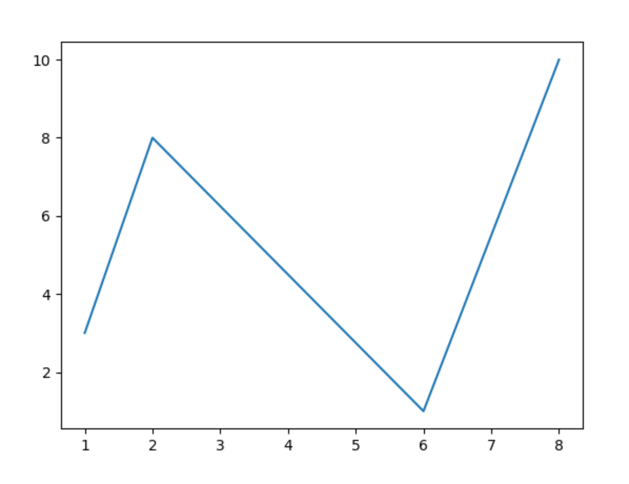

# Matplotlib note

# Matplotlib.pyplot

```Python
import Matplotlib.pyplot as plt
```

Ví dụ:

```Python
import matplotlib.pyplot as plt
import numpy as np

xpoints = np.array([1, 8])
ypoints = np.array([3, 10])

plt.plot(xpoints, ypoints)
plt.show()
```

Kết quả:


Ví dụ trên sẽ vẽ đường nối 2 điểm `(1,8)` và `(3,10)`

Để chỉ vẽ 2 điểm `(1,8)` và `(3,10)`, ta thêm parameter như sau:

```Python
import matplotlib.pyplot as plt
import numpy as np

xpoints = np.array([1, 8])
ypoints = np.array([3, 10])

plt.plot(xpoints, ypoints, 'o')
plt.show()
```

Kết quả:


Ta có thể vẽ nhiều đường liên tục như sau:

```Python
import matplotlib.pyplot as plt
import numpy as np

xpoints = np.array([1, 2, 6, 8])
ypoints = np.array([3, 8, 1, 10])

plt.plot(xpoints, ypoints)
plt.show()
```

Kết quả:



Đối với mảng như trên thì các điểm sẽ được lấy lần lượt là `(1,3), (2,8), (6,1), (8,10)`.

Nếu như chỉ truyền vào một mảng thì sẽ mặc định nó là mảng `ypoints` và khi đó `xpoints` sẽ tương ứng lần lượt với các phần từ của `ypoints` là `[0,1,2,3...]`


```Python
import matplotlib.pyplot as plt
import numpy as np

ypoints = np.array([3, 8, 1, 10, 5, 7])

plt.plot(ypoints)
plt.show()
```

Kết quả:


# Maker

Thêm parameter với keyword `marker` để chọn show các điểm với hình dạng mong muốn:

```Python
import matplotlib.pyplot as plt
import numpy as np

ypoints = np.array([3, 8, 1, 10])

plt.plot(ypoints, marker = 'o')
plt.show()
```

Kết quả:


Nếu ta thay bằng như sau:

```Python
plt.plot(ypoints, marker = '*')
```


Thì kết quả :


Ta có maker reference:

Marker | Description
-------|------------
'o' | Circle | 
'*' | Star | 
'.' | Point | 
',' | Pixel | 
'x' | X | 
'X' | X (filled) | 
'+' | Plus | 
'P' | Plus (filled) | 
's' | Square | 
'D' | Diamond | 
'd' | Diamond (thin) | 
'p' | Pentagon | 
'H' | Hexagon | 
'h' | Hexagon | 
'v' | Triangle Down | 
'^' | Triangle Up | 
'<' | Triangle Left | 
'>' | Triangle Right | 
'1' | Tri Down | 
'2' | Tri Up | 
'3' | Tri Left | 
'4' | Tri Right | 
'|' | Vline | 
'_' | Hline

# Có thể thay đổi style của marker, màu của marker,màu viền marker, style của line, màu của line

# Có thể set được title, xlabel, ylabel của đồ thị và style của chúng như sau:

```Python
import numpy as np
import matplotlib.pyplot as plt

x = np.array([80, 85, 90, 95, 100, 105, 110, 115, 120, 125])
y = np.array([240, 250, 260, 270, 280, 290, 300, 310, 320, 330])

font1 = {'family':'serif','color':'blue','size':20}
font2 = {'family':'serif','color':'darkred','size':15}

plt.title("Sports Watch Data", loc = 'left')
plt.xlabel("Average Pulse",fontdict=font1)
plt.ylabel("Calorie Burnage",fontdict=font2)

plt.plot(x, y)
plt.show()
```

# Show Grid và style của grid

```Python
import numpy as np
import matplotlib.pyplot as plt

x = np.array([80, 85, 90, 95, 100, 105, 110, 115, 120, 125])
y = np.array([240, 250, 260, 270, 280, 290, 300, 310, 320, 330])

plt.title("Sports Watch Data")
plt.xlabel("Average Pulse")
plt.ylabel("Calorie Burnage")

plt.plot(x, y)

plt.grid()

plt.show()
```

Kết quả:


Ta dùng lệnh `plt.grid()` để hiện `grid`. Default sẽ là show cả 2 grid trục x và y. Nếu ta truyền vào tham số:
`plt.grid(axis='x')` hoặc `plt.grid(axis='y')` Thì sẽ chỉ show grid trục x hoặc trục y.

Ngoài ra có thể style cho grid như sau:

```Python
import numpy as np
import matplotlib.pyplot as plt

x = np.array([80, 85, 90, 95, 100, 105, 110, 115, 120, 125])
y = np.array([240, 250, 260, 270, 280, 290, 300, 310, 320, 330])

plt.title("Sports Watch Data")
plt.xlabel("Average Pulse")
plt.ylabel("Calorie Burnage")

plt.plot(x, y)

plt.grid(color = 'green', linestyle = '--', linewidth = 0.5)

plt.show()
```

Kết quả:


# Ta có thể vẽ nhiều độ thị trên một hệ trục tọa độ nếu như chỉ có một lệnh show:

```Python
import numpy as np
import matplotlib.pyplot as plt


ypoints = np.array([3, 8, 1, 10, 5, 7])


plt.plot([1,3,2,5,9])


x = np.array([80, 85, 90, 95, 100, 105, 110, 115, 120, 125])
y = np.array([240, 250, 260, 270, 280, 290, 300, 310, 320, 330])

plt.title("Sports Watch Data")
plt.xlabel("Average Pulse")
plt.ylabel("Calorie Burnage")
plt.plot(x, y)

plt.grid(color = 'green', linestyle = '--', linewidth = 0.5)

plt.show()
```

Kết quả:


# Có thể một lúc display nhiều đồ thị với mỗi đồ thị ở một cửa số bằng cách thêm `figure(tên cửa sổ)` trước mỗi lệnh `plt.plot()`

```Python
import numpy as np
import matplotlib.pyplot as plt

ypoints = np.array([3, 8, 1, 10, 5, 7])

plt.figure(200)

plt.plot([1,3,2,5,9])
# plt.show()

x = np.array([80, 85, 90, 95, 100, 105, 110, 115, 120, 125])
y = np.array([240, 250, 260, 270, 280, 290, 300, 310, 320, 330])

plt.title("Sports Watch Data")
plt.xlabel("Average Pulse")
plt.ylabel("Calorie Burnage")

plt.figure()
plt.plot(x, y)

plt.grid(color = 'green', linestyle = '--', linewidth = 0.5)

plt.show()
```

Lưu ý chỉ có 1 lệnh `show()` đặt ở cuối cùng để có thể show nhiều cửa sổ một lúc. Nếu đặt lệnh `show()` sau mỗi lệnh `plot()` thì các cửa số sẽ lần lượt hiện ra. phải đóng cửa số này xong mới mở được cửa sổ khác.


# Có thể vẽ nhiều đồ thị trên cùng một cửa sổ như sau:

```Python
import matplotlib.pyplot as plt
import numpy as np

#plot 1:
x = np.array([0, 1, 2, 3])
y = np.array([3, 8, 1, 10])

plt.subplot(2, 1, 1)
plt.plot(x,y)

#plot 2:
x = np.array([0, 1, 2, 3])
y = np.array([10, 20, 30, 40])

plt.subplot(2, 1, 2)
plt.plot(x,y)

plt.show()
```

Kết quả:


Hàm `subplot(a,b,c)` nhận vào 3 tham số, gọi ra trước mỗi lệnh `plot` của mỗi đồ thị với ý nghĩa là:

- `a`: Cửa sổ có `a` dòng
- `b`: Cửa số có `b` cột
- `c`: Thứ tự của đồ thị hiện tại trong cửa sổ.

Tất cả tham só đều bắt đầu từ 1.

Dĩ nhiên có thể đặt tên các trục, tên đồ thị, tên của toàn bộ window như sau:

```Python
import matplotlib.pyplot as plt
import numpy as np

#plot 1:
x = np.array([0, 1, 2, 3])
y = np.array([3, 8, 1, 10])

plt.subplot(1, 2, 1)
plt.plot(x,y)
plt.title("SALES")

#plot 2:
x = np.array([0, 1, 2, 3])
y = np.array([10, 20, 30, 40])

plt.subplot(1, 2, 2)
plt.plot(x,y)
plt.title("INCOME")

plt.suptitle("MY SHOP")
plt.show()
```

Kết quả:


Chú ý cách thiết lập của các đồ thị, tên trục, tên đồ thị... đề đặt ngay trước hoặc sau lệnh `plot()` (lệnh vẽ đồ thị) của độ thị cần vẽ.

# Scatter Plot

Ta có thể vẽ tập các điểm bằng lệnh `.scatter()`

```Python
import matplotlib.pyplot as plt
import numpy as np

#day one, the age and speed of 13 cars:
x = np.array([5,7,8,7,2,17,2,9,4,11,12,9,6])
y = np.array([99,86,87,88,111,86,103,87,94,78,77,85,86])
plt.scatter(x, y)

#day two, the age and speed of 15 cars:
x = np.array([2,2,8,1,15,8,12,9,7,3,11,4,7,14,12])
y = np.array([100,105,84,105,90,99,90,95,94,100,79,112,91,80,85])
plt.scatter(x, y)

plt.show()
```

Kết quả:


Có thể specify color của các điểm hoặc mỗi điểm.

```Python
import matplotlib.pyplot as plt
import numpy as np

x = np.array([5,7,8,7,2,17,2,9,4,11,12,9,6])
y = np.array([99,86,87,88,111,86,103,87,94,78,77,85,86])
plt.scatter(x, y, color = 'hotpink')

x = np.array([2,2,8,1,15,8,12,9,7,3,11,4,7,14,12])
y = np.array([100,105,84,105,90,99,90,95,94,100,79,112,91,80,85])
plt.scatter(x, y, color = '#88c999')

plt.show()
```


**Specify color cho từng điểm bằng cách truyền mảng cho tham số color:**

```Python
import matplotlib.pyplot as plt
import numpy as np

x = np.array([5,7,8,7,2,17,2,9,4,11,12,9,6])
y = np.array([99,86,87,88,111,86,103,87,94,78,77,85,86])
colors = np.array(["red","green","blue","yellow","pink","black","orange","purple","beige","brown","gray","cyan","magenta"])

plt.scatter(x, y, c=colors)

plt.show()
```

Kết quả:


## Ta có thể lấy màu bằng color bar...

đọc thêm

## specify size của các điểm 

```Python
import matplotlib.pyplot as plt
import numpy as np

x = np.array([5,7,8,7,2,17,2,9,4,11,12,9,6])
y = np.array([99,86,87,88,111,86,103,87,94,78,77,85,86])
sizes = np.array([20,50,100,200,500,1000,60,90,10,300,600,800,75])

plt.scatter(x, y, s=sizes)

plt.show()
```

Kết quả:


# Matplotlib Bars

Tương tự như cách vẽ `scatter` và `plot` thông thường. Nhưng đối với `bar` thì tham số x sẽ là tên trường, y là giá trị của trường.

```Python
import matplotlib.pyplot as plt
import numpy as np

x = np.array(["A", "B", "C", "D"])
y = np.array([3, 8, 1, 10])

plt.bar(x,y)
plt.show()
```

Kết quả:


Vẽ horizontal bar bằng lệnh `barh`

```Python
import matplotlib.pyplot as plt
import numpy as np

x = np.array(["A", "B", "C", "D"])
y = np.array([3, 8, 1, 10])

plt.barh(x, y)
plt.show()
```


## có thể define thêm màu và độ dày của bar 

```Python
import matplotlib.pyplot as plt
import numpy as np

x = np.array(["A", "B", "C", "D"])
y = np.array([3, 8, 1, 10])

plt.bar(x, y, color = "hotpink", width=0.1)
plt.show()
```


Đối với `horizontal` thì `width` thay bằng `height`

Default thì `width` và `height` là 0.8

# Histogram

Dùng hàm `hist`

```Python
import matplotlib.pyplot as plt
import numpy as np

x = np.random.normal(170, 10, 250)

plt.hist(x)
plt.show() 
```

Kết quả:


# Pie chart

