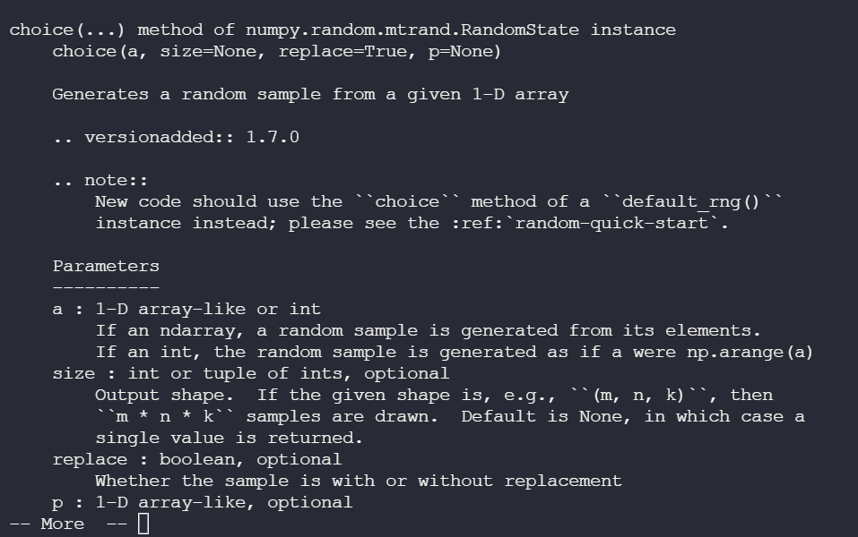

# Numpy note

# I. Vector (mảng)

## Tạo mảng:

```Python
import numpy as np

Arr = np.array([2,3,4,5,1,6,7]);
# hoac
Arr1 = np.array([2,3,4,1,2,5,],dtype="kdl");

#mảng 2 chiều
Arr2 = np.array([[1,2,3],[4,5,6]],dtype...);
```

`kdl` là kiểu dữ liệu, gồm:

- `i` - integer
- `b` - boolean
- `u` - unsigned integer
- `f` - float
- `c` - complex float
- `m` - timedelta
- `M` - datetime
- `O` - object
- `S` - string
- `U` - unicode string
- `V` - fixed chunk of memory for other type ( void )

hoặc thay `"kdl"` bằng `int`, `str`, `float`,`bool` đều được.

## Số chiều:

```Python
arr.ndim
#trả về
# 1: mảng một chièu
# 2: mảng 2 chiều
# 3: mảng 3 chiều
#...
```


## Index:

Các mảng truy cập theo index như sau:

1 chiều: như mảng bình thường

loại mảng | truy cập | giải thích
----------|----------|-----------
2 chiều|`arr[a,b]`| hàng a, cột b
3 chiều|`arr[a,b,c]`|hàng b, cột c -- phần tử index a của mảng 3 chiều

## Slicing:

1 chiều:

```Python
arr[start:end]# mặc định là 1
arr[start:end:step]
arr[:]# cả mảng
arr[::]# phần tử có index chẵn
arr[1::]# phần tử có index lẻ
arr[-1]# phần tử cuối mảng
```

2 chiều:

```Python
arr[hàng,cột]
arr[start:end,start:end]
...# tương tự như 1 chiều
```

## Copy và View

```Python
arr = np.array([1,2,3,3,4]);

x = arr.view();
y = arr.copy();
```

`x` là mảng view, tức là `x` thay đổi => `arr` thay đổi và ngược lại.

`y` là một copy, độc lập với `arr` tức là việc thay đổi hay bất cứ việc gì của `y` không liên quan đến `arr`

```Python

x.base# trả về mảng
y.base# trả về None
```

Vậy `.base` đối với `view` trả về chính nó, `.base` của `copy` trả về `None`.

## Phép toán với mảng

```Python
arr = np.array([1,2,3,4,5])

x = 2**arr# kết quả là mảng [2^1, 2^2, 2^3,...]
```

```Python
x = arr**2# kết quả là mảng [1^2, 2^2, 3^2...]
```

```Python
x = arr*2# kết quả là [1*2, 2*2, 3*2...]

```

Tương tự với các phép toán khác.

## Array Shape

```Python
arr.shape

#ví dụ
arr([1,2,3,4]) # (4,)
arr([[1,2,3],[1,2,3]]) # (2,3) - 2 hàng 3 cột
arr([[[1],[2],[3]]])
 # (1,3,1) - mảng 3 chiều có 1 phần từ - phẩn tử này có 3 mảng 2 chiều, mỗi mảng 2 chiều có một phần tử.
```

```Python
arr = np.array([[1,2],[3]])
print(arr.shape)
# (2,)
```

Đây là cách tạo không hợp lệ nhưng nếu in thì vẫn ra thế kia tức là coi như `[1,3]` =>> mảng 1 chiều 2 phần tử

## Join

Dùng hàm `.concatenate((arr1,arr2,arr3...),axis=?)`

Tham số `axis` là `0` hoặc `1`, với `0` là join theo cột, `1` là join theo hàng. Nếu không có tham số `axis` thì mặc định là `0`, join theo cột.

Với mảng một chiều thì chỉ có `axis=0`, không cần truyền gì hết.

```Python

arr1 = np.array([1, 2, 3])

arr2 = np.array([4, 5, 6])

arr = np.concatenate((arr1, arr2))
# kq: [1,2,3,4,5,6]
```

```Python
arr1 = np.array([[1, 2], [3, 4]])

arr2 = np.array([[5, 6], [7, 8]])

arr = np.concatenate((arr1, arr2), axis=1)
# [
#   [1,2,5,6],
#   [3,4,7,8]
#  ]
```

Giải thích `arr1` có 2 hàng `[1,2]` và `[3,4]`, `arr2` có 2 hàng `[5,6]` và `[7,8]`. Vậy `axis=0` join theo hàng sẽ join `[1,2]` với `[5,6]` ( hàng có index 0).

join `[3,4]` và `[7,8]` (Hàng có index 1).

Nếu ví dụ trên với `axis = 0` Thì join theo cột 

Biểu diễn hình dạng ma trận:

```Python
 1 2  và 5 6
 3 4     7 8

```

Vậy join cột như sau: cột 1-3-5-7 ( lưu ý join thành 1 cột), cột 2-4-6-8

==> Kết quả:

```Python
[
    [1,2],
    [3,4],
    [5,6],
    [7,8]
]
```

Hoặc có thể nói như sau: `0` là Join theo thứ tự đi từ ma trận cha vào, `1` từ ma trận con vào.

Như vậy đối với axis `0` đi từ ma trận cha thì giống như join ma trận 1 chiều thành một ma trận cha gồm 2 chiều gồm `[1,2],[3,4],[5,6],[7,8]`

Đối với axis `1` đi từ ma trận con vào thì join các mảng 1 chiều cùng index...


## Nhân hai mảng (vector)

Hai mảng nhân với nhau cần cùng số chiều. Nhân hai mảng tương đương với việc tính tích vô hướng của 2 vecto

```Python
x = np.arange(3) # [0,1,2]
y = np.ones(3) # [1,1,1]

z = x*y #0*1 + 1*1 + 1*2 = 3

```

Hoặc

```Python
z = np.dot(x,y)
```

Hoặc

```Python
z = x.dot(y)
```

Nói chung, các phép toán cho mảng 2 chiều với nhau là element wise, tức là từng cặp phần tử cùng vị trí với nhau.

# II. Ma trận


## Chú ý truy cập ma trận

```Python
A >> array([[ 1,  2,  3,  4],
       [ 5,  6,  7,  8],
       [ 9, 10, 11, 12]])
```

```Python
>>> A[[0, 2], -1] # the first and the third elements in the last column
## A[0,-1] và A[2,-1]
array([ 4, 12])
```

```Python
>>> A[[1, 2]][:, [0,3]]
array([[ 5,  8],
       [ 9, 12]])
```

Được hiểu như sau: lấy ra 2 hàng có chỉ số `1` và `2` của A. Ví dụ là ma trận B

```Python
B = [
    [1,2,3,4]
    [5,6,7,8]
]
```

==> Kết quả cuối cùng là `B[:,[0,3]]` tức là lấy ra các phần tử ở cột `0` và `3` của B.

**Cặp tọa độ:**

Nếu như lấy như sau:

```Python
>>> A[[1, 2], [0, 3]]
array([ 5, 12])
```

Lấy như trên thì ta sẽ được là `A[1,0]` và `A[2,3]`

```Python
>>> A[[1, 2], [0]] # equivalent to A[[1, 2], [0, 0]]
array([5, 9])
```


## Các phép toán trên ma trận (mảng nhiều chiều)

Ví dụ với các hàm `np.sum, np.min,np.max, np.mean`

```Python
import numpy as np
A = np.array([[1., 2, 3, 2], [4, 3, 7, 4], [1, 4, 2, 3]])
A
array([[ 1.,  2.,  3.,  2.],
       [ 4.,  3.,  7.,  4.],
       [ 1.,  4.,  2.,  3.]])
```

Các hàm liệt kê trên sẽ tác động lên ma trận mặc  theo `axis = 0` tức là theo cột hoặc `axis=1` theo hàng. Nếu không đề cập tới `axis` thì sẽ tác động lên toàn bộ ma trận.

```Python
>>> np.sum(A, axis = 0)
array([  6.,   9.,  12.,   9.])

"""
1+4+1 = 6
2+3+4 = 9
3+7+2 = 12
2+4+3 = 9
"""


>>> np.min(A, axis = 0)
array([ 1.,  2.,  2.,  2.])

"""
min(1,4,1) = 1
min(2,3,4) = 2
...
"""


>>> np.max(A, axis = 0)
array([ 4.,  4.,  7.,  4.])
>>> np.mean(A, axis = 0)
array([ 2.,  3.,  4.,  3.])

"""
tính trung bình cộng theo cột
"""
```

Theo `axis = 1`, theo hàng:

```Python
>>> np.sum(A, axis = 1)
array([  8.,  18.,  10.])
>>> np.min(A, axis = 1)
array([ 1.,  3.,  1.])
>>> np.max(A, axis = 1)
array([ 3.,  7.,  4.])
>>> np.mean(A, axis = 1)
array([ 2. ,  4.5,  2.5])
```

Khi không đề cập đến `axis` thì tính theo cả ma trận:

```Python
>>> np.sum(A)
36.0
>>> np.min(A)
1.0
>>> np.max(A)
7.0
>>> np.mean(A)
3.0
```

**Chú ý**

### keepdims = True

Đôi khi, để thuận tiện cho việc tính toán về sau, chúng ta muốn kết quả trả về khi `axis = 0` là các vector hàng thực sự, khi `axis = 1` là các vector cột thực sự. Để làm được việc đó, Numpy cung cấp thuộc tính `keepdims = True` (mặc định là `False`). Khi `keepdims = True`, nếu sử dụng `axis = 0`, kết quả sẽ là một mảng hai chiều có chiều thứ nhất bằng 1 (coi như ma trận một hàng). Tương tự, nếu sử dụng `axis = 1`, kết quả sẽ là một mảng hai chiều có chiều thứ hai bằng 1 (một ma trận có số cột bằng 1). Việc này, về sau chúng ta sẽ thấy, quan trọng trong nhiều trường hợp đặc biệt:

```Python
>>> np.sum(A, axis = 0, keepdims = True)
array([[  6.,   9.,  12.,   9.]])
>>> np.mean(A, axis = 1, keepdims = True)
array([[ 2. ],
       [ 4.5],
       [ 2.5]])
```

## Các phép toán của ma trận với một số vô hướng tác động lên từng phần tử của ma trận giống như đối với mảng một chiều;

```Python
>>> import numpy as np 
>>> A = np.array([[1, 3], [2, 5]])
>>> A
array([[1, 3],
       [2, 5]])
>>> A + 2
array([[3, 5],
       [4, 7]])
>>> A*2
array([[ 2,  6],
       [ 4, 10]])
>>> 2**A
array([[ 2,  8],
       [ 4, 32]])
```

## Các phép toán giữa hai ma trận cũng giống như với mảng 1 chiều,là element wise, thực hiện trên từng cặp phần tử và kết quả là một ma trận cùng kích thước.

```Python
>>> import numpy as np 
>>> A = np.array([[1., 5], [2, 3]])
>>> B = np.array([[5., 8], [7, 3]])
>>> A*B
array([[  5.,  40.],
       [ 14.,   9.]])
>>> A**B
array([[  1.00000000e+00,   3.90625000e+05],
       [  1.28000000e+02,   2.70000000e+01]])
```

**Chú ý:** `A*B` không phải là tích giữa 2 ma trận như trong đại số mà là tích theo `element wise` như đã nói ở trên.

## Ma trận chuyển vị

Để thực hiện ma trận chuyển vị có thể dùng `.T` hoặc `np.transpose()`

```Python
>>> import numpy as np 
>>> A = np.array([[1, 2, 3],[4, 5, 6]])
>>> A
array([[1, 2, 3],
       [4, 5, 6]])
>>> A.T 
array([[1, 4],
       [2, 5],
       [3, 6]])
>>> np.transpose(A)
array([[1, 4],
       [2, 5],
       [3, 6]])
```


## Reshape ma trận

```Python
>>> np.reshape(A, (3, 2))
array([[1, 2],
       [3, 4],
       [5, 6]])
>>> A.reshape(3, 2)
array([[1, 2],
       [3, 4],
       [5, 6]])
```

```Python
>>> np.reshape(A, 6) # to a 1d numpy array
array([1, 2, 3, 4, 5, 6])
>>> A.reshape(3, 1, 2) # to a 3d numpy array 
array([[[1, 2]],

       [[3, 4]],

       [[5, 6]]])
```

Ta không nhất thiết phải xác định rõ hết số chiều của ma trận khi reshape, ta chỉ cần biết được ít nhất một chiều và để `-1` cho các chỉ số còn lại, ma trận sẽ được tụ động tính toán chiều còn lại (Do số phần tử của ma trận không đổi)

```Python
>>> A.reshape(-1) # to 1d array, its size must be 6
array([1, 2, 3, 4, 5, 6])
>>> np.reshape(A, (6, -1)) # ~ a 2d array of shape 6x1
array([[1],
       [2],
       [3],
       [4],
       [5],
       [6]])
```


**Chú ý thứ tự của phép toán reshape**

- Trong reshape ta có thể truyền vào tham số `order='F'` hoặc `order='C'`. Nếu không truyền thì mặc định sẽ là `C`.

Trong đó đối với:

- `order='C'` - Phép toán reshape được thực hiện từ trong ra ngoài (`axis=1`-> `axis=0`). Tức là thực hiện theo từng hàng một

- `order='F'` - Phép toán reshape được thực hiện từ ngoài vào trong (`axis=0`-> `axis=1`). Tức là thực hiện theo từng cột một.


```Python
>>> A
array([[1, 2, 3],
       [4, 5, 6]])
>>> A.reshape(3, -1, order = 'F')
array([[1, 5],
       [4, 3],
       [2, 6]])
>>> 
```

```Python
np.reshape(A,(3,-1),order='C')

array([
       [1,2],
       [3,4],
       [5,6]
])
```


## Phép toán giữa ma trận và mảng một chiều

Khi thực hiện phép toán giữa ma trận và vector thì phép toán sẽ được thực hiện giữa từng hàng của ma trận với vector đó theo quy tắc elment wise.

```Python
>>> import numpy as np 
>>> A = np.arange(12).reshape(3, -1)
>>> A
array([[ 0,  1,  2,  3],
       [ 4,  5,  6,  7],
       [ 8,  9, 10, 11]])
>>> b = np.array([1., 2, 3, 5])
>>> A + b
array([[  1.,   3.,   5.,   8.],
       [  5.,   7.,   9.,  12.],
       [  9.,  11.,  13.,  16.]])
>>> A*b 
array([[  0.,   2.,   6.,  15.],
       [  4.,  10.,  18.,  35.],
       [  8.,  18.,  30.,  55.]])
```

Tương tự với các phép `-,*,/`.

**Chú ý, vector thực hiện phép toán phải có số chiều = số phần tử trên một hàng của ma trận.**


## Phép nhân ma trận với ma trận, ma trận với vector chuẩn theo đại số:


### 1. Tích của ma trận với ma trận


Để tính tích như trên, ta dùng `np.dot(A,B)` hoặc `A.dot(B)`

Chú ý, quy tắc tính nhân ma trận tuân theo đại số. Tức là số cột của A phải = số hàng của B hay ` A.shape[1] == B.shape[0] `

```Python
>>> import numpy as np 
>>> A = np.arange(12).reshape(4, 3)
>>> A
array([[ 0,  1,  2],
       [ 3,  4,  5],
       [ 6,  7,  8],
       [ 9, 10, 11]])
>>> B = np.arange(-5, 7).reshape(3,-1)
>>> B
array([[-5, -4, -3, -2],
       [-1,  0,  1,  2],
       [ 3,  4,  5,  6]])
>>> A.dot(B)
array([[  5,   8,  11,  14],
       [ -4,   8,  20,  32],
       [-13,   8,  29,  50],
       [-22,   8,  38,  68]])
>>> np.dot(A, B)
array([[  5,   8,  11,  14],
       [ -4,   8,  20,  32],
       [-13,   8,  29,  50],
       [-22,   8,  38,  68]])
```

Tích của ma trận thì có tính kết hợp `ABC = A(BC)=(AB)C` và không có tính giao hoán. Cần phải chú ý.

### 2. Tích của ma trận và vector

Chú ý rằng. Mảng một chiều được tạo bởi `np.array` 

```Python
>>> A
array([[ 0,  1,  2],
       [ 3,  4,  5],
       [ 6,  7,  8],
       [ 9, 10, 11]])
>>> b = np.array([1, 3, 4])
```

```Python
>>> A.dot(b)
array([11, 35, 59, 83])
>>> A*b
array([[ 0,  3,  8],
       [ 3, 12, 20],
       [ 6, 21, 32],
       [ 9, 30, 44]])
```

Ta thấy khi thực hiện nhân đại số `A.dot(b)`(`b` đứng sau trong phép toán) `b` sẽ được coi như một vector cột `(3,1)` nên kết quả của `A.dot(b)` sẽ là một mảng một chiều có có số phần tử là 4 như quy tắc nhân trong đại số.

Tuy nhiên khi thực hiện `b.dot(A)` thì `b` sẽ lại được coi như một vector hàng `(1,3)` và không thỏa mãn phép nhân.

```Python
>>> b.dot(A)
Traceback (most recent call last):
  File "<stdin>", line 1, in <module>
ValueError: shapes (3,) and (4,3) not aligned: 3 (dim 0) != 4 (dim 0)
>>> c = np.array([1, 2, 3, 4])
>>> c.dot(A)
array([60, 70, 80])
```

Ta thấy ví dụ với `c` thì thỏa mã vì `c` được coi như vector hàng `(1,4)` đáp ứng `c.shape[1] == A.shape[0]`. 

# III. Số ngẫu nhiên

## Tạo số ngẫu nhiên trong nửa đoạn từ [0-1)

```Python
>>> import numpy as np 
>>> np.random.rand() 
0.38919680466308004
>>> np.random.rand(3)
array([ 0.48677611,  0.70819795,  0.32393605])
>>> np.random.rand(3, 2)
array([[ 0.29713565,  0.57377171],
       [ 0.0365262 ,  0.04146013],
       [ 0.63039945,  0.8643891 ]])
```

Hoặc dùng

```Python
np.random.seed()
```

## Tạo số nguyên ngẫu nhiên

Dùng `np.random.randint`:


```Python
from numpy import random

print(random.randint(100))# Tạo ra số nguyên nằm trong nửa đoạn [0,100)

print(random.randint(100, size=(5))) # Tạo mảng có 5 phần tử là số nguyên nằm trong nửa đoạn [0.100)

print(random.randint(2,100,size=(2,3)))

#hoặc

print(random.randint(2,100,(2,3)))

#Đều là tạo ra mảng 2 chiều kích thuowowccs (2,3) có các phần tử là các số nguyên nằm trong nửa đoạn [2,100).
"""
Nếu như randint(low,hight,size=()) nếu truyền vào kích thước thì không cần size=() mà chỉ cần short hand ()

Nếu như randint(hight, size=()) thì kích thước bắt buộc p có size không sẽ gây ra lỗi vì khi có 2 tham số thì mặc định tham số 1 = low, tham số 2 = high
"""
```

## Lấy ra một số phần tử bất kì của một mảng:

Dùng hàm `np.random.choice()`:



```Python
from numpy import random

x = random.choice([3, 5, 7, 9])

print(x)
```

Nếu như chỉ truyền vào mảng thì hàm sẽ trả về 1 phần tử.

```Python
from numpy import random

x = random.choice([3, 5, 7, 9], size=(3, 5))

print(x)
```

Nếu như truyền vào size thì kết quả trả về sẽ là mảng có số chiều là size và các phần tử của mảng là ngẫu nhiên từ mảng truyền vào hàm `choice`

Chúng ta có thể define ra xác suất xuất hiện nếu lấy ra của các phần tử mảng qua `p` parameter truyền vào hàm như sau:

```Python
from numpy import random

x = random.choice([3, 5, 7, 9], p=[0.1, 0.3, 0.6, 0.0], size=(100))

print(x)
```

Trong đó mảng xác suất p gồm các số thực nằm trong đoạn từ `[0-1]` sao cho tổng các xác suất `=1` Và xác suất `0` tương ứng với trường hợp không bao giờ xuất hiện phần tử và `1` tương ứng với luôn luôn xuất hiện. Các xác suất được sắp xếp theo thứ tự tương ứng với từng phần tử mảng.

Trong ví dụ trên các xác suất và phần tử mảng tương ứng là `3-xs:0.1`, `5-xs:0.3`, `7-xs:0.6`, `9-xs:0`.

Như vậy dòng lệnh sẽ cho kết quả là mảng 100 phần tử, trong đó không có phần tử nào là `9` do xác suất = 0.

## Hoán vị

Để sinh ra một hoán vị của một tập hợp thì dùng các hàm `random.shuffle` hoặc `random.permutation`

Trong đó cả 2 hàm đều sinh ra hoán vị của tập hợp nhưng `shuffle` thì biến đổi tập hợp gốc còn `permutation` thì không. Và `shuffle` thì phải truyền vào mảng còn `permutation` thì có thể truyền vào một số hoặc một mảng.

**shuffle:**


**permutation**


Nếu chỉ truyền vào một số `n` thì `permutation` sẽ cho ra một hoán vị gồm các số nguyên từ `0 - (n-1)`