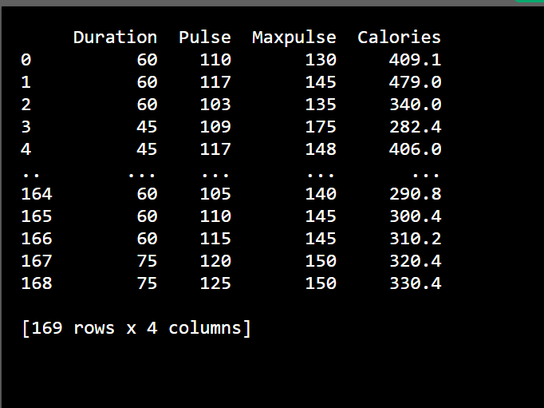

# Pandas note

```Python
import pandas as pd
```

# Series:

Series của pandas là dạng cột của bảng với dữ liệu tạo bởi mảng một chiều

Ví dụ:

```Python
import pandas as pd

a = [1, 7, 2]

myvar = pd.Series(a)

print(myvar)
```

Kết quả:


Nếu như không truyền thêm tham số gì vào thì kết quả trả ra sẽ có dạng như trên với `0,1,2` chính là label. Có thể dùng label để truy cập đến phần tử của series:

```Python
print(myvar[0])
```

Ta có thể define label của series thông qua tham số `index` truyền vào hàm

```Python
import pandas as pd

a = [1, 7, 2]

myvar = pd.Series(a, index = ["x", "y", "z"])

print(myvar)
```

Kết quả:


Ta có thể truy cập phần tử của series thông qua label:

```Python
print(myvar["y"])
#hoặc
print(myvar[1])
```

dùng cả 2 đều được.

## Có thể khởi tạo series bằng dictionary. Khi đó các key của dictionary chính là label:

```Python
import pandas as pd

calories = {"day1": 420, "day2": 380, "day3": 390}

myvar = pd.Series(calories)

print(myvar)
```

Để truy cập thì vẫn dùng `myvar["key"]` hoặc `myvar[0], myvar[1]...`

Có thể specify items nào từ dict để cho vào Series bằng cách thêm index:

```Python
import pandas as pd

calories = {"day1": 420, "day2": 380, "day3": 390}

myvar = pd.Series(calories, index = ["day1", "day2"])

print(myvar)
```

Như vậy chỉ có 2 phần tử key `day1, day2` được cho vào trong Series.

# DataFrames

DataFrames là cấu trúc bảng trong Python

```Python
import pandas as pd

data = {
  "calories": [420, 380, 390],
  "duration": [50, 40, 45]
}

#load data into a DataFrame object:
df = pd.DataFrame(data)

print(df) 
```

Kết quả:


Trường index tự động sinh ra giống như series

Ta có thể truy cập đến từng dòng của dataframe như sau:

```Python
#refer to the row index:
print(df.loc[0])
```

Kết quả:


```Python
#use a list of indexes:
print(df.loc[[0, 1]])
```

Kết quả:


Tương tự với Series, ta có thể define label cho từng dòng dữ liệu với tham số `index`

```Python
import pandas as pd

data = {
  "calories": [420, 380, 390],
  "duration": [50, 40, 45]
}

df = pd.DataFrame(data, index = ["day1", "day2", "day3"])

print(df) 
```

Kết quả:


Và có thể truy cập đến các phần tử bằng label của nó như đỗi với index tự sinh

# Đọc ghi file CSV

```Python
import pandas as pd

df = pd.read_csv('data.csv')

print(df.to_string()) 
```

Đối với tập dữ liệu có nhiều dòng, nếu in ra thì dataframe chỉ in ra 5 dòng đầu và 5 dòng cuối. Dùng `to_string` để in ra toàn bộ các dòng dữ liệu.



KHi dùng `to_string`:


Hoặc có thể lệnh cho dataframe in ra max row mong muốn. Vì mặc định mỗi system sẽ in ra một số dòng nhất định. Ta có thểm kiểm tra bằng lệnh `pd.options.display.max_rows`

Và define max row in ra bằng lệnh tương ứng

```Python
import pandas as pd

pd.options.display.max_rows = 9999

df = pd.read_csv('data.csv')

print(df) 
```

# Đọc file JSON

Tương tự như đọc và in ra file `.csv`

```Python
import pandas as pd

df = pd.read_json('data.json')

print(df.to_string())
```

Do JSON có cấu trúc giống với dictionary của Python nên việc add JSON vào Dataframe của pandas cũng giống như làm với dictionary

```Python
import pandas as pd

data = {
  "Duration":{
    "0":60,
    "1":60,
    "2":60,
    "3":45,
    "4":45,
    "5":60
  },
  "Pulse":{
    "0":110,
    "1":117,
    "2":103,
    "3":109,
    "4":117,
    "5":102
  },
  "Maxpulse":{
    "0":130,
    "1":145,
    "2":135,
    "3":175,
    "4":148,
    "5":127
  },
  "Calories":{
    "0":409,
    "1":479,
    "2":340,
    "3":282,
    "4":406,
    "5":300
  }
}

df = pd.DataFrame(data)

print(df) 
```

# Analyzing data

Ta có thể trích xuất dữ liệu , xem thống kê tổng quan dữ liệu bằng các lệnh `.head(), .tail(), .info()`

```Python
import pandas as pd

df = pd.read_csv('data.csv')

print(df.head(10))
```

Với lệnh trên sẽ chỉ in ra 10 dòng đầu tiên của tập dữ liệu đọc vào. ( Dữ liệu đọc vào là dataframe)


Nếu không truyền gì vào `head()` thì sẽ mặc định in ra 5 dòng.

Tương tự với lệnh `.tail` sẽ là in ra số dòng cuối cùng của tập dữ liệu.

Với lệnh `info`, ta có thể xem được tổng quan thông tin tập dữ liệu 

```Python
print(df.info()) 
```

Kết quả:


# Cleaning data

Dùng để loại bỏ đi những bad data trong tập dữ liệu bao gồm:

- ô dữ liệu trống
- dữ liệu sai định dạng
- dữ liệu sai
- dữ liệu lặp

**Ví dụ tập dữ liệu**

```Python

      Duration          Date  Pulse  Maxpulse  Calories
  0         60  '2020/12/01'    110       130     409.1
  1         60  '2020/12/02'    117       145     479.0
  2         60  '2020/12/03'    103       135     340.0
  3         45  '2020/12/04'    109       175     282.4
  4         45  '2020/12/05'    117       148     406.0
  5         60  '2020/12/06'    102       127     300.0
  6         60  '2020/12/07'    110       136     374.0
  7        450  '2020/12/08'    104       134     253.3
  8         30  '2020/12/09'    109       133     195.1
  9         60  '2020/12/10'     98       124     269.0
  10        60  '2020/12/11'    103       147     329.3
  11        60  '2020/12/12'    100       120     250.7
  12        60  '2020/12/12'    100       120     250.7
  13        60  '2020/12/13'    106       128     345.3
  14        60  '2020/12/14'    104       132     379.3
  15        60  '2020/12/15'     98       123     275.0
  16        60  '2020/12/16'     98       120     215.2
  17        60  '2020/12/17'    100       120     300.0
  18        45  '2020/12/18'     90       112       NaN
  19        60  '2020/12/19'    103       123     323.0
  20        45  '2020/12/20'     97       125     243.0
  21        60  '2020/12/21'    108       131     364.2
  22        45           NaN    100       119     282.0
  23        60  '2020/12/23'    130       101     300.0
  24        45  '2020/12/24'    105       132     246.0
  25        60  '2020/12/25'    102       126     334.5
  26        60    2020/12/26    100       120     250.0
  27        60  '2020/12/27'     92       118     241.0
  28        60  '2020/12/28'    103       132       NaN
  29        60  '2020/12/29'    100       132     280.0
  30        60  '2020/12/30'    102       129     380.3
  31        60  '2020/12/31'     92       115     243.0
```

Ta thấy như dòng 22,18 thì có ô trống, dữ liệu là NaN. 
Dòng 26 có format dữ liệu tại cột Date sai.
Dòng 27 cột duration dữ liệu bị sai vì số phút vượt quá 1 tiếng.
Dòng 11 và 12 bị lặp dữ liệu

## Giải quyết Empty cells

### Cách thứ nhất để giải quyết vấn đề này là loại bỏ chúng đi. Tuy nhiên cách này sẽ ok chỉ nếu như tập dữ liệu của chúng ta rất lớn và việc loại bỏ đi số dòng chứa empty cell kia không là vấn đề gì.

```Python
import pandas as pd

df = pd.read_csv('data.csv')

new_df = df.dropna()

print(new_df.to_string())
```

Hàm `.dropna()` sẽ trả về một tập dữ liệu mới mà đã được remove tất cả các hàng có ô dữ liệu trống mà không làm thay đổi tập dữ liệu gốc.

Nếu muốn thay đổi tập dữ liệu gốc thì thêm tham số `inplace=True`. Lúc này thì `.dropna(inplace= True)` không trả về gì hết. Chỉ thay đổi trực tiếp tập dữ liệu gốc.

### Cách khác để giải quyết là điền giá trị vào các ô có dữ liệu trống

Với cách này thì phải xem xét dữ liệu điền vào thế nào cho hợp lý. Cách thông thường là chúng ta điền vào các giá trị `mean`, `median` hoặc `mode` của cột vào ô.

```Python
import pandas as pd

df = pd.read_csv('data.csv')

x = df["Calories"].mean()

df["Calories"].fillna(x, inplace = True)
```

trong đó 

- `.mean()`: trả về giá trị trung bình của cột
- `.median()`: trả về giá trị nằm chính giữa tập giá trị của cột sau khi đã sắp xếp tập giá trị tăng hoặc giảm giần.
- `.mode()`: trả về giá trị xuất hiện nhiều nhất của tập giá trị.

## Giải quyết Format sai

Có hai cách, cách 1 khuyền dùng là format lại tất cả giá trị của cột thành một format duy nhất. Nếu không được thì dùng cách 2

Cách 2 là xóa dòng có dữ liệu bị format sai đi bằng dropnna

```Python
df.dropna(subset=['Date'], inplace = True)
```

## Giải quyết dữ liệu sai

Khi nhìn vào tập dataset ta có thể đoán được ô dữ liệu nào đó sai khi một mình nó một kiểu trong cột dữ liệu. Khi đó có 2 cách để giải quyết là sửa dữ liệu hoặc xóa dòng đó đi.

Để truy cập vào từng điểm dữ liệu trong datafram thì ta có syntax:

```Python
df.loc[label, tencot]
```

Để truy cập vào tập label của dataframe thì dùng

```Python
df.index
```

Ví dụ cách sửa:

```Python
for x in df.index:
  if df.loc[x, "Duration"] > 120:
    df.loc[x, "Duration"] = 120
```

Ví dụ cách xóa:

```Python
for x in df.index:
  if df.loc[x, "Duration"] > 120:
    df.drop(x, inplace = True)
```

## Giải quyết dữ liệu lặp

Có thể biết được dòng dữ liệu nào bị lặp lại bằng cách nhìn hoặc dùng `duplicated`

Method này sẽ trả về một series với dữ liệu là `True` đối với cột bị lặp và `False` nếu cột không bị lặp.

Để xóa các dòng bị lặp

```Python
df.drop_duplicates(inplace = True)
```

# Correlations

```Python
df.corr()
```

Kết quả:


hàm `.corr` trả về bảng cho thấy mối quan hệ giữa từng cặp cột với nhau bằng các giá trị dao động trong đoạn `[-1,1]`. trong đó trị tuyệt đối của các giá trị này càng gần về 1 thì mqh giữa chúng càng tốt và ngược lại.

Với các giá trị càng gần về 1 có nghĩa là khi các giá trị của cột này tăng thì cột kia cũng vậy (đồng biến)

Vơi các giá trị càng gần về -1 cũng vậy, truy nhiên 2 cột sẽ có mối quan hệ đối nghịch tức cột này tăng thì cột kia giảm và ngược lại.

# Pandas plotting

Dataframe có hàm `plot` của nó. Ta chỉ cần dùng `plt.show()` của matplotlib để show ra.

**Ví dụ**

```Python
import pandas as pd
import matplotlib.pyplot as plt

df = pd.read_csv('data.csv')

df.plot()

plt.show()
```

Đối với `plot()` không truyền vào tham số gì thì kết quả in ra như sau:


Ta có thể chỉ định ra show những cột nào trên đồ thị, và loại đồ thị.

```Python
df.plot(kind = 'scatter', x = 'Duration', y = 'Calories')
```

Kết quả:


Lưu ý loại đồ thị và dữ liệu show ra. Ở trên là dạng đồ thị điểm cho nên cần tập các điểm. Nếu như tập điểm là 4 như ví dụ đầu tiên mà ta dùng `scatter` thì sẽ báo lỗi.

Ví dụ dùng Histogram với cột:

```Python
df["Duration"].plot(kind = 'hist')
```

Kết quả:


